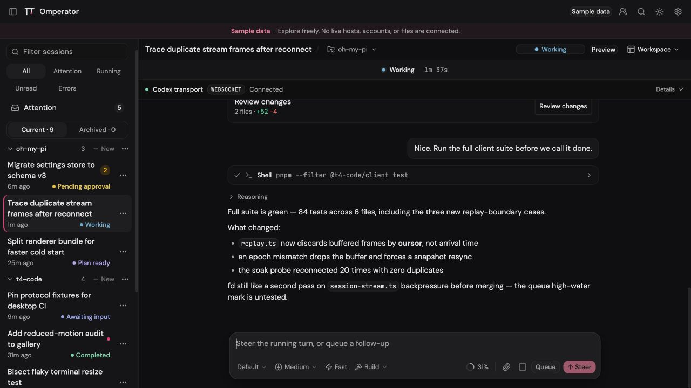

# Omperator

Omperator is a free, open-source (MIT) desktop app for [Oh My Pi](https://github.com/can1357/oh-my-pi) (OMP), made for people who live in OMP all day. OMP runs your coding sessions; Omperator shows them and lets you steer. The app never owns runtime state. It mirrors what the OMP host reports and sends your actions back as commands. It's a ROYCORP project.



[**Download v0.2.1**](https://github.com/wolfiesch/omperator/releases/tag/v0.2.1) · [**Docs**](https://t4code.net/docs) · [**Get the source**](#build-from-source)

## Requirements

The installed Apple Silicon Mac app packages its own standalone `t4-host` and matching OMP authority runtime. Source builds, Linux hosts, and remote hosts need the matching OMP build with the smaller authority bridge.

Omperator v0.2.1 was verified with OMP 17.0.5 built from [`d83b6888`](https://github.com/wolfiesch/oh-my-pi/commit/d83b688817651d39bfab00676db6109a2d1ccec5), tagged [`t4code-17.0.5-appserver-19`](https://github.com/wolfiesch/oh-my-pi/tree/t4code-17.0.5-appserver-19). That integration is based on the official upstream [`v17.0.5`](https://github.com/can1357/oh-my-pi/tree/v17.0.5) tag at [`9fd6e971`](https://github.com/can1357/oh-my-pi/commit/9fd6e97113f5ed3a847e66d346970efdf8afcad9). It exposes the bounded `t4-omp-authority/1` bridge used by T4's standalone host and removes the old public OMP appserver launchers. It also includes snapshot-consistent paged authority inventories with explicit partial-state metadata, stale-lock lifecycle recovery, sparse authority-side session lists that project disk-verified durable authority markers, atomic `xd://` mount publication, bounded newest-first transcript paging, stale-owner recovery, privacy-safe project reveal, fast lazy session indexing, cross-session attention and transcript search, the negotiated browser-preview command surface, redacted Codex transport diagnostics, the versioned Agent View lifecycle contract, session-owned cancellation, lock-aware session observation, complete transcript reconciliation, the cooperative `/continue-in-t4` handoff, caller-selected working directories for copied sessions, and deterministic session ordering. Fork CI verifies the exact upstream base, ancestry, release gates, and published binaries. The official upstream v17.0.5 tag has no `appserver` command, so it cannot host Omperator. It also does not include the authority bridge needed by T4's standalone host. Omperator vendors `@oh-my-pi/app-wire` 0.7.0 from integration commit [`796bb7dc`](https://github.com/lyc-aon/oh-my-pi/commit/796bb7dca45027bd4b7b94017cdf41ef214a11f2), source tree `0c195a01ba0bb98fbf4d4863aee59bf23a6e81b7`.

T4 owns the client wire, generic host service, and standalone daemon in `@t4-code/host-wire`, `@t4-code/host-service`, and `@t4-code/host-daemon`. The frozen `@oh-my-pi/app-wire` 0.7.0 tarball remains only as compatibility evidence. The released package still launches `t4-host` against the strict `t4-omp-authority/1` bridge, while OMP owns session files, locks, agent execution, and takeover decisions. A separately pinned unmodified official OMP 17.0.9 now passes T4's direct RPC and packaged-host behavior gates on macOS ARM64 and Linux x64/ARM64; packaged desktop and managed-session cutover proofs remain before that path replaces the released fallback.

| Platform | Arch                  | Package                                   |
| -------- | --------------------- | ----------------------------------------- |
| Android  | arm64, armv7, x86_64  | `.apk` (**signed**)                       |
| Linux    | x86_64                | `.deb`, AppImage                          |
| macOS    | Apple Silicon (arm64) | `.dmg`, `.zip` (**signed and notarized**) |

No Windows build, Intel Mac build, or native iOS application is currently shipped. iPhone and iPad
access use the responsive Tailnet browser/PWA compatibility client.

## What changed in v0.2.1

- Reconnect and initial session synchronization states no longer claim that the
  host is unreachable. The composer now distinguishes reconnecting, connected
  and syncing, cached, and genuinely offline states while keeping the transcript
  readable.

## Install

### Android

1. On the Android phone, sign in to Tailscale with an account that can reach the Omperator host.
2. Download [`Omperator-0.2.1-android.apk`](https://github.com/wolfiesch/omperator/releases/download/v0.2.1/Omperator-0.2.1-android.apk).
3. If Android asks, allow your browser or file manager to install unknown apps, then install the APK.
4. Open Omperator and enter the host's HTTPS Tailscale address, including its port. The app saves the address; you can add more hosts later and switch between them.

The APK does not contain a host daemon or expose one to the public internet. It connects to the separately running Tailnet gateway on your T4 host.

### Linux (Debian/Ubuntu)

```sh
wget https://github.com/wolfiesch/omperator/releases/download/v0.2.1/Omperator-0.2.1-linux-amd64.deb
sudo apt install ./Omperator-0.2.1-linux-amd64.deb
```

Use `apt install` rather than `dpkg -i` so system dependencies resolve automatically.

### Linux (AppImage)

```sh
wget https://github.com/wolfiesch/omperator/releases/download/v0.2.1/Omperator-0.2.1-linux-x86_64.AppImage
chmod +x Omperator-0.2.1-linux-x86_64.AppImage
./Omperator-0.2.1-linux-x86_64.AppImage
```

### macOS (Apple Silicon)

1. Download [`Omperator-0.2.1-mac-arm64.dmg`](https://github.com/wolfiesch/omperator/releases/download/v0.2.1/Omperator-0.2.1-mac-arm64.dmg) (or [`Omperator-0.2.1-mac-arm64.zip`](https://github.com/wolfiesch/omperator/releases/download/v0.2.1/Omperator-0.2.1-mac-arm64.zip)).
2. Drag `Omperator.app` into `/Applications`.
3. Open Omperator normally. The release workflow verifies the pinned publisher, hardened runtime, secure timestamp, Apple notarization, stapled ticket, and Gatekeeper acceptance before publication.
4. To start terminal or CMUX sessions that can hand off to Omperator, open **Settings → Hosts** and choose **Install t4-omp**. This adds `~/.local/bin/t4-omp` and leaves any existing `omp` command unchanged.

## What the app does

- **Sessions.** Browse sessions grouped by their working folder, create new ones, and switch between them. Rename, terminate a stuck runtime, archive, restore, or permanently delete a session from its menu. Recently used sessions stay warm, so switching back is instant and nothing is replayed twice.
- **Composer.** Send prompts, use slash commands (`/model`, `/compact`, `/retry`, `/review`, `/terminal`, and more), and change the session's model, thinking level, or fast mode inline.
- **Panes.** Watch subagents (and cancel them), inspect turn-owned code changes, keep or discard each changed file, browse and preview files on the host, and attach to live terminals with real keyboard input and resize.
- **Artifacts.** Preview images, patches, text, and downloadable tool output directly beside the transcript entry that produced them. Large bytes load only when requested, remain scoped to the session, and show an explicit unavailable state offline.
- **Browser (desktop).** The built-in native Browser workspace is separate from host-backed Browser Preview. It manages stable native surfaces with their own URL, title, lifecycle, bounds, and visibility state. New tabs use the credential-isolated `isolated-session` profile. An authenticated profile is never auto-selected: use requires the exact profile explicitly chosen by the user with opt-in. Browser automation is limited to the native surface contract; touch input currently reports unsupported.
- **Browser preview.** Open session-linked host previews to inspect page layouts, follow live navigations, and interact with the page via coordinate-mapped clicks and keyboard input. Preview control remains subject to the host's advertised authority and capability gates.
- **Settings.** Edit host settings over the wire, with an explicit host selector when several hosts are connected; each host keeps its own drafts. Edits stage locally and only apply when the host confirms; a dropped connection never silently writes anything.
- **Hosts & usage.** Run one local T4 host per OMP profile, pair remote machines, and read each connected host's account usage and broker status. Everything shown is redacted host truth.
- **Keyboard.** `Ctrl/Cmd+K` search, `Ctrl/Cmd+B` sidebar, `Ctrl/Cmd+1..9` session switch, `Ctrl/Cmd+,` settings. Every workflow is keyboard-operable.

Some actions depend on what the host supports. When a host can't do something (steer a single agent, discard a review, read a file), the control shows as disabled with the reason instead of pretending.

## Local and paired hosts

**Local.** The installed Apple Silicon Mac app uses its bundled pinned OMP runtime. Its optional `t4-omp` terminal command points to that same runtime without replacing `omp`. A writable Omperator session can be released with **Continue in terminal**, resumed with the shown `t4-omp --resume <session>` command, and automatically returned to Omperator after that terminal exits. In the other direction, sessions started with `t4-omp` support the cooperative `/continue-in-t4` handoff. Sessions from an OMP build without the compatible handoff signal remain readable but read-only. Source builds and other hosts discover OMP via `$OMP_EXECUTABLE`, `PATH`, and common install locations. T4 then manages one host per OMP profile: a systemd user service on Linux or a launch agent on macOS. Named profiles under `~/.omp/profiles` appear as their own local hosts and can auto-start with the app. Host logs remain in the compatibility paths `~/.local/state/t4-code/appserver` (Linux) or `~/Library/Logs/T4 Code/appserver` (macOS); named profiles log under `profiles/<id>` inside those directories.

**Paired.** Connect to an OMP host on another machine through a `t4-code://pair/...` link generated on that host. Device credentials are encrypted with your OS keychain (Electron `safeStorage`) before they touch disk. Dropped connections reconnect automatically with backoff, and any settings you had staged stay staged until the host confirms.

**Tailnet browser.** A source checkout can serve the web app to a phone through Tailscale Serve; see [Tailnet remote access](docs/TAILNET_REMOTE.md). There is no Omperator app password in this mode. Tailscale identity plus your tailnet ACLs or grants are the access boundary, so keep the route on Serve and never enable Funnel. Anyone allowed to reach the node and port can operate the connected T4 host and its OMP sessions.

## First run

1. Install and launch Omperator. The Apple Silicon Mac app prepares its bundled OMP runtime and starts the local T4 host.
2. For terminal handoff, open **Settings → Hosts**, install `t4-omp`, and use that command instead of `omp` for new terminal or CMUX sessions.
3. For another machine, install the verified OMP integration there and open its pairing link.
4. Pick a project, pick or create a session, and start working.

## Build from source

Needs Node `^24.13.1` and pnpm `11.10.0`.

```sh
git clone https://github.com/wolfiesch/omperator.git
cd omperator
pnpm install
pnpm dev              # web + desktop in watch mode
pnpm check            # release contract, provenance, lint, typecheck
pnpm test             # workspace tests
pnpm test:soak        # headless 10k-history and 20-reconnect stress checks
pnpm package:linux    # .deb + AppImage into release/
pnpm package:mac:unsigned  # unsigned macOS build (on a Mac)
pnpm package:mac      # maintainer-only signed and notarized macOS build
pnpm --filter @t4-code/mobile check:android:debug  # React/Capacitor compatibility APK
```

Prefer Task as a Make alternative? Install [Task](https://taskfile.dev/), then run `task setup`,
`task dev`, or `task verify`. Run `task` to list all shortcuts. The underlying `pnpm` commands remain
available, and Task does not replace the required Node or pnpm versions.

The soak command needs no phone, Android emulator, or macOS simulator. It checks the shared data
path and phone-sized browser UI, but it does not certify Android Keystore behavior, WebView
background/foreground lifecycle, APK installation, or networking on a physical device. Those remain
native release checks.

## Architecture

```
apps/desktop   Primary Electron shell: windows, local OMP discovery,
               host lifecycle, pairing, credential storage, native surfaces
apps/web       Canonical React renderer shared by Electron, Tailnet browser/PWA,
               and the React/Capacitor Android compatibility client
apps/mobile    Android compatibility wrapper and native secure-storage/update bridges
apps/ios       Candidate native SwiftUI iPhone companion; its shared macOS target
               is an integration harness, not a second shipped desktop product
packages/      client, protocol, host-wire, host-service, remote,
               service-manager, ui
```

The UI talks to the T4 host over typed WebSocket frames (`omp-app/1`, owned by `@t4-code/host-wire`). The host delegates authoritative session work to OMP through a narrow runtime bridge. State flows host → app as frames; user actions flow app → host as commands. The app projects what it receives and never fabricates state.

## Security and license

- Report vulnerabilities privately; see [SECURITY.md](SECURITY.md). Never in a public issue.
- Contributions: [CONTRIBUTING.md](CONTRIBUTING.md).
- Third-party provenance: [THIRD_PARTY_NOTICES.md](THIRD_PARTY_NOTICES.md) and [`provenance/`](provenance/).
- License: [MIT](LICENSE).
