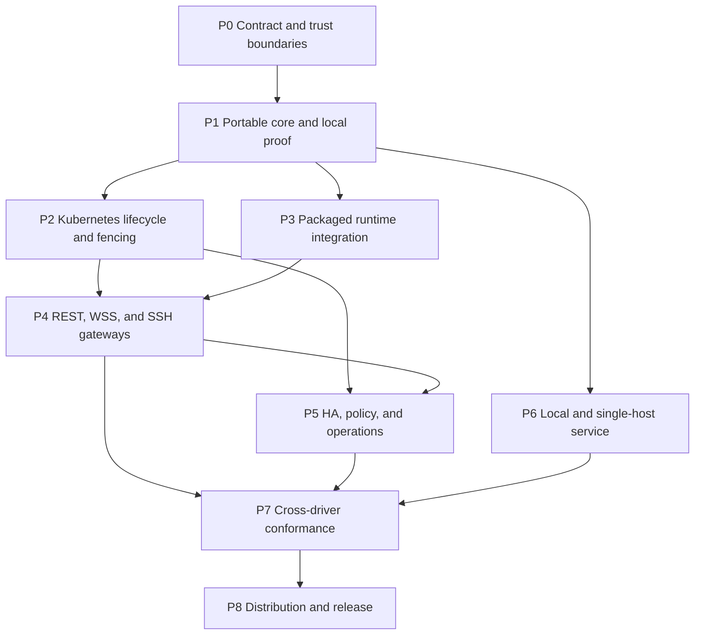

# Portable Agent Platform v1 implementation tracker

- Status: implementation in progress; P0, P1, P2-01 through P2-06, P3-01 through P3-03, and P4 are complete
- Source specification: <https://roycorp.net/briefs/omperator-portable-agent-platform-v1-f4c81ee5.html>
- Source SHA-256: `f31778a0d57b3b39b822faa0d6e7a3f1af2888dd09a9a39780025c43acce6194`
- Specification baseline: `wolfiesch/omperator@2ab8fc7`, `manaflow-ai/cmux@192e444`, `can1357/oh-my-pi@d16c616`
- Repository review baseline: `48b1ba7b94f468154ed0e0998118d01f7dbffbd0`
- Execution tracker: project-local `td` database under `.todos/`

## Completed work packages

- **P0-01:** `compat/portable-agent-platform-v1.json` pins the specification and exact Omperator, cmux, official OMP, and packaged OMP authorities. `pnpm check:portable-platform` fails closed on drift.
- **P0-02:** `vendor/cmux-machine-provider-v1/` contains the byte-exact upstream Rust protocol crate source at the pinned cmux commit. The typed Rust generator emits control and provider-stream handoff fixtures, while `provenance/cmux-machine-provider-v1.json` records source objects, digests, generator inputs, corpus membership, and the tooling-only packaging boundary. `pnpm test:portable-platform` and `pnpm check:portable-platform` enforce the import.
- **P0-03:** `docs/adr/025-portable-runtime-single-authority.md` fixes the process topology: `t4-host` owns the sole writable OMP RPC child, raw RPC stays on child stdio, and the future cmux terminal client attaches to that same authority over runtime-local `omp-app/1` instead of opening the session as another writer. `compat/portable-agent-platform-v1.json` records the machine-checkable cardinality, transport, attach, and admission rules; the portable-platform checker rejects weakened writer or RPC exposure. The ADR intentionally makes no cmux, deployment, or conformance claim.
- **P0-04:** `packages/t4-api-contract/openapi.json` now defines only the OpenAPI 3.1 portable discovery, scope, workspace, runtime lifecycle, connection-descriptor, and infrastructure-invalidation surface. `packages/t4-api-client/` consumes the generated types and enforces bearer ownership, strong revision ETags, RFC 9457 Problem Details, bounded responses, and lifecycle-only SSE. The deterministic conformance fixture covers explicit-ID creation, optimistic concurrency, action idempotency, pagination, public route descriptors, and reconnect/reset behavior without a REST terminal, transcript, command, snapshot, browser, or OMP event stream.
- **P0-05:** `docs/adr/021-portable-driver-control-contracts.md` defines backend-neutral resource-driver and capability operations, exact internal `cmux-v10` and `omp-app-v1` generation-bound routes, preconditioned equality-only revisions, exact replica-safe idempotency identity/operations, 60-second digest-only tickets with generation binding and invalidation, bounded pre-delete tombstones with stable-ID non-reuse, and a bounded gap-free infrastructure event journal with exact entry/reset shapes. `compat/portable-agent-platform-v1.json` pins the exact contract and ADR digest; the portable-platform checker rejects invariant weakening, documentation drift, and backend-coordinate or edge-endpoint field leakage. PostgreSQL remains optional alongside conforming SQLite and Kubernetes-object implementations, and P1-01 remains the first code implementation.
- **P0-06:** `docs/adr/022-portable-identity-authorization-contract.md` defines the required provider-neutral adapter categories, server-derived versioned principals and authorities, exact Section 13.2 canonical actions, opaque policy-bound roles, explicit-allow decisions, the exact capability intersection, and exhaustive REST/SSE, `omp-app/1`, opaque direct cmux WSS, SSH/provider-control, and internal-route mappings. `compat/portable-agent-platform-v1.json` pins the exact contract and ADR digest; the portable-platform checker derives current OpenAPI operation IDs, `COMMAND_DESCRIPTORS` keys, client-frame types, and machine-provider request variants from source and rejects catalog drift or fail-open weakening. This package is contract-only: P1-01 is the first product-neutral types work, and runtime, gateway, deployment, audit persistence, and threat-check implementation remain in later packages.
- **P0-07:** `docs/adr/023-portable-lifecycle-state-machines.md` fixes desired-state, runtime-generation, drain, positive fence proof, replacement, deletion/finalizer/retention, snapshot/restore, storage-separation, composite-readiness, and route/ticket invalidation contracts. Uncertain fencing has exactly one terminal outcome for an automatic attempt: internal `FenceUncertain`, publicly projected as `Degraded` plus `Fenced=False` reason `FenceUncertain`; it blocks generation advance, attachment, replacement, routes, tickets, and finalizer progress until fresh authoritative proof is obtained and manual recovery is recorded under a new revision. Deletion drains, revokes, quiesces, and waits for positive fence proof before writing a durable retained tombstone immediately ahead of backend cleanup. `compat/portable-agent-platform-v1.json` and the portable-platform checker pin the exact contract, ADR digest, OpenAPI vocabularies, and ADR-025/021 alignment. This package is contract-only and makes no runtime, controller, CRD, OpenAPI, generated SDK, or conformance implementation claim; those remain P1/P2/P3/P4/P5/P7 work.
- **P0-08:** `docs/adr/024-portable-threat-model.md` enumerates every public and internal trust boundary and fixes transport-, provider-, driver-, and backend-neutral fail-closed controls for ticket replay, sender identity, shell/path injection, credential exposure, cross-scope access, duplicate writers, runtime isolation, and audit leakage. `compat/portable-agent-platform-v1.json` pins the exact threat-model contract and ADR digest; the portable-platform checker validates all fields, ADR-021/022/023/025 and runtime-topology relationships, independent whole-object and semantic mutations, and backend/identity-provider-neutrality. This is contract-only and makes no runtime, deployment, schema, or conformance claim.
- **P1-01:** `packages/portable-core/src/index.ts` owns dependency-neutral readonly portable resource, lifecycle, capability, page, request, and RFC 9457 Problem Details types with strict path-aware throwing decoders. `packages/portable-core/test/decoders.test.ts` consumes the relevant examples from `packages/t4-api-contract/openapi.json` and records boundary, extension, closed-request, uniqueness, timestamp, and safe-integer cases. `packages/t4-api-client/src/index.ts` reuses the core decoders for overlapping capability, resource, page, timestamp, revision, generation, phase, and Problem Details response validation.

## Review verdict

The proposed platform architecture is directionally sound. It preserves the right authority boundaries: exact upstream `machine-provider-v1` and cmux protocol v10, the existing `omp-app/1` application wire, raw OMP RPC on stdio only, and one fenced OMP/cmux writer per runtime. Its portable driver model and separation between highly available gateways and non-active-active runtimes are also correct.

The delivery phases are not safe or efficient to execute literally. The implementation must first resolve several contract gaps, then prove the provider/runtime path locally before expanding the Kubernetes plane. In particular, storage separation and fencing cannot wait until after cmux is placed in the runtime, and local parity cannot wait until the end because it is the cheapest reference implementation of the common driver and provider contracts.

P0 contract review is complete through P0-08. ADR-024 closes the threat-model contract gap and pins executable negative mutations, while runtime enforcement and Appendix B.10 conformance evidence remain in their assigned P1 through P7 work packages.

## Current repository baseline

| Area | Present now | Missing for the specification |
|---|---|---|
| Kubernetes resources | `T4ClusterHost`, `T4Workspace`, and `T4Session` CRDs; guarded additive lifecycle; leader-elected controllers | Desired power state, runtime generation, stable external identity/tombstones, idle and connection policy, separate runtime-state storage |
| Workspace/session reconciliation | RWX workspace PVC, one deterministic Pod and Service per `T4Session`, ownership and precondition checks | Sleeping/stopped states, old-writer proof, generation-bound routing, runtime-state PVC, wake/failover state machine |
| Application gateway | Replicated Bun gateway serving `omp-app/1` at `/v1/ws`; Tailscale trusted-proxy identity; Kubernetes projection and pod routing | REST lifecycle/discovery, SSE, scope model, pluggable identity, cmux routes, SSH provider gateway |
| Runtime | Pinned OMP bridge, one host service, Xvfb/Chromium option, durable OMP/browser state | Upstream headless cmux, cmux durable state and writer lease, protocol v10 route, shared readiness and shutdown supervision |
| Credential plane | Separate allowlisted model gateway; runtime pods receive no reusable provider credentials | Provider-neutral identity/credential adapters and complete audit coverage for new front doors |
| REST contract | Checked-in OpenAPI 3.1 portable discovery, scope, workspace, runtime lifecycle, connection-descriptor, and infrastructure-invalidation contract with generated SDK types and deterministic conformance fixtures | Deployable REST/SSE gateway and driver/controller integration, implemented in P2 and P4 |
| Packaging | Portable Helm chart, immutable digest inputs, strict NetworkPolicies, PDB/topology for existing shared services | SSH service, HPA, runtime-state storage values, image pre-pull, OCI/signing evidence, GitOps/Terraform examples |
| Conformance | Existing `omp-app/1`, OMP bridge, cluster, packaging, and release gates | Upstream cmux/provider fixtures and all Appendix B portable-platform scenarios |

Source anchors include `packages/cluster-operator/api/v1alpha1/types.go`, `packages/cluster-operator/controllers/session_controller.go`, `packages/cluster-server/src/server.ts`, `packages/cluster-server/src/gateway.ts`, `packages/cluster-server/src/session-host-main.ts`, `cluster/images/session-runtime/session-entrypoint.sh`, `packages/t4-api-contract/openapi.json`, and `deploy/charts/t4-cluster/`.

## Corrections required before implementation

1. **Preserve the three existing CRDs.** The specification explicitly keeps `cluster.t4.dev/v1alpha1` and maps REST `runtime` to `T4Session`. Do not add a competing `T4Runtime` CRD. Extend `T4Session` additively and map its Kubernetes name/UID plus a deletion tombstone to the stable REST runtime identity.
2. **Replace the undeployed REST contract cleanly.** The existing `t4-api-contract` uses `/v1/sessions`, command submission, snapshots, and session event streaming. The target contract uses `/v1/runtimes` and lifecycle invalidations only. There are no external users, so replace it and all in-repo generated callers and fixtures without shims.
3. **Resolve the cmux/OMP topology before code.** The current runtime starts one OMP authority through the host service. The specification also says a cmux user can start OMP through a terminal. Starting a second OMP would violate the single-writer invariant. The contract must define how cmux exposes or attaches to the existing authority, and the first-prompt conformance test must prove both client families observe the same OMP session.
4. **Move storage separation and fencing ahead of Kubernetes cmux rollout.** cmux SQLite/WAL and browser/OMP state cannot first be placed on an arbitrary RWX workspace and migrated later. Establish the runtime-state volume and fencing contract before declaring the Kubernetes provider usable.
5. **Build the local vertical slice before the replicated SSH edge.** Prove exact provider control/stream framing and a real headless cmux process through the direct command connector first. The SSH gateway should then be a strict authenticated transport wrapper, not the first place protocol behavior is debugged.
6. **Define the shared control-store semantics.** Atomic ticket consumption, 24-hour idempotency, deletion tombstones, and resumable SSE across replicas are not supplied merely by saying “use Kubernetes resources.” Specify keys, compare-and-swap behavior, retention, cleanup, replay, and fail-closed behavior. Local mode uses SQLite; Kubernetes mode uses reviewed Kubernetes objects and optimistic concurrency unless evidence requires a different shared store.
7. **Use OpenSSH as the boring v1 SSH boundary.** Prefer a hardened `sshd` deployment with stable administrator-managed host keys and a forced-command dispatcher. Do not implement a general shell or a custom SSH server unless the forced-command design cannot meet the pinned cmux contract.
8. **Define identity and scopes before exposing front doors.** Tailscale currently yields one principal string. OIDC, SSH keys/certificates, automation identity, scope membership, roles, and cross-scope denial need one provider-neutral authorization interface and one source of scope membership.
9. **Reconcile upstream pins.** The specification pins OMP `d16c616`, while the packaged runtime currently pins the T4 OMP bridge build at `ca2902bc…`. Select one tested OMP/cmux/host image set before adding runtime behavior. No component rolls independently.
10. **Treat SLOs as targets until measured.** Startup and failover values require source hash, built image digests, environment, scenario, iterations, and artifacts. No release or tracker entry may convert the proposed targets into observed guarantees without that evidence.

## Non-negotiable invariants

- One requested top-level runtime maps to one `T4Session`, one cmux machine, and at most one live runtime pod/process group.
- OMP owns sessions, turns, prompts, approvals, subagents, jobs, artifacts, cancellation, and takeover.
- cmux owns terminal panes, workspace registry, layouts, VT state, and cmux browser panes.
- Kubernetes/local drivers own infrastructure desired state only.
- `machine-provider-v1`, cmux protocol v10, and `omp-app/1` are transported exactly. No private terminal, browser, transcript, or agent wire is added.
- Raw OMP RPC, cmux Unix sockets, CDP, filesystem locks, and runtime credentials remain internal.
- Status and lifecycle events contain infrastructure truth only.
- A replacement writer is never started while the prior writer's ability to mutate durable state is uncertain.
- Credentials, prompts, terminal bytes, paths, browser pixels, and unbounded identifiers never enter CR status, discovery, logs, metrics, or traces.
- Unsupported capabilities are omitted and fail with typed unsupported results; they are never advertised speculatively.

## Revised delivery sequence

P2, P3, and P6 may run concurrently only after P0/P1 freeze their shared interfaces. P4 waits for both Kubernetes generation routing and the real runtime stream. P8 is the only publication phase and retains the normal point-of-risk approval gate.

## Work packages

### P0 — Contract, topology, and trust boundaries

| ID | Deliverable | Depends on | Acceptance | Default executor |
|---|---|---|---|---|
| P0-01 | Rebaseline the external specification and record exact OMP/cmux/Omperator pins | None | Source digest and current repository head are recorded; mismatched OMP pin is resolved | Main |
| P0-02 | Import or generate upstream provider schemas and golden control/stream fixtures | P0-01 | No hand-copied reduced schema; fixture provenance is pinned | GPT-5.6 medium |
| P0-03 | Decide and document the one-authority cmux/OMP process topology | P0-01 | cmux and `omp-app/1` operate on one OMP authority; no second OMP process can write the session | Main |
| P0-04 | Replace the OpenAPI draft with runtime lifecycle/discovery resources | P0-01 | OpenAPI 3.1 validates; no REST terminal/transcript/browser stream remains | GPT-5.6 medium |
| P0-05 | Define driver, route, control-store, revision, ticket, tombstone, and event-journal interfaces | P0-03, P0-04 | Local and Kubernetes backends can implement one contract without transport-specific fields | Main |
| **P0-06 — complete** | Define principal, scope, role, action, policy, and capability intersection | P0-04 | Every REST/WSS/SSH action has a deny-by-default authorization decision | GPT-5.6 medium |
| **P0-07 — complete** | Define desired-state, generation, drain, fence, replacement, deletion, and restore state machines | P0-03, P0-05 | Uncertain fencing has one explicit fail-closed terminal state, `FenceUncertain` | Main |
| **P0-08 — complete** | Threat-model all public and internal boundaries | P0-05, P0-06, P0-07 | Ticket replay, sender identity, shell/path injection, credential exposure, cross-scope access, and duplicate writer threats have executable checks | GPT-5.6 medium + fresh review |

### P1 — Portable core and local protocol proof

| ID | Deliverable | Depends on | Acceptance | Default executor |
|---|---|---|---|---|
| **P1-01 — complete** | Implement product-neutral resource, revision, phase, capability, and Problem Details types | P0 | Strict decoders and bounded fields match OpenAPI examples | GPT-5.6 medium |
| **P1-02 — complete** | Implement SQLite local registry, idempotency ledger, ticket CAS, tombstones, and event journal | P0-05, P1-01 | Exact retries replay; conflicting retries reject; ticket use is atomic; retention is bounded | GPT-5.6 medium |
| **P1-03 — complete** | Implement `LocalDriver` process/directory lifecycle with generation-bound routes | P0-05, P0-07, P1-01 | Create, get, update, sleep, wake, stop, delete, and watch converge against real processes | GPT-5.6 medium |
| **P1-04 — complete** | Pin/build upstream cmux and start a real headless process with private socket and durable state | P0-02, P0-03 | `identify` reports protocol 10; duplicate writer/corrupt state fails closed; socket paths stay under platform limits | GPT-5.6 medium |
| **P1-05 — complete** | Implement exact provider control and stream engines independent of SSH | P0-02, P1-02, P1-03, P1-04 | Golden frames pass; ticket handshake becomes an unmodified cmux v10 stream | GPT-5.6 medium |
| **P1-06 — complete** | Add direct-command `omperatorctl provider --endpoint <https-url> --profile <name> control\|stream` adapter | P1-05 | cmux consumes its command-prefix terminator and appends exactly `control` or `stream`; no shell evaluation or catalog translation | GPT-5.6 low/medium |
| **P1-07 — complete** | Prove an unmodified cmux client can list, create, open, close, sleep, wake, and reconnect locally | P1-03 through P1-06 | Real client scenario passes with frame-hash no-translation evidence | Main verification |

**P1-02 evidence:** `packages/portable-control-store/src/index.ts` implements the SQLite resource registry, revision CAS, atomic workspace/runtime attachment transactions, idempotency reservations, generation-bound one-use ticket consumption, bounded tombstones, retained event cursors, configuration intents, backend cleanup records, and start-attempt ownership. `packages/portable-control-store/test/sqlite-control-store.test.ts` covers exact replay/conflict behavior, retention gaps, pagination high-water cursors, corruption rejection, atomic lifecycle transactions, and generation/principal/audience ticket binding.

**P1-03 evidence:** `packages/portable-driver/src/index.ts` implements stable-ID local resources, private bounded storage paths, durable configuration and start-attempt recovery, exact-revision cross-controller start ownership, generation-bound route publication, ordered ticket/credential revocation, positive process-group and open-handle fencing, managed/adopted process-loss convergence, idempotent tombstone cleanup, and deterministic shutdown. `packages/portable-driver/test/local-driver.test.ts` exercises real SQLite state and real process groups across create, update, sleep, wake, stop, delete, restart adoption, configuration/start crash boundaries, concurrent controllers, stale drainers, orphan credentials, unexpected exits, descendant cleanup, route generations, cursor watches, and fail-closed fencing.

**P1-05 evidence:** `packages/provider-engine/src/control-engine.ts` implements the exact vendored `machine-provider-v1` request registry, additive outer envelopes, strict nested fields, server-derived authorization, idempotent actions, and session-owned connection closure. `packages/provider-engine/src/stream-engine.ts` consumes a generation-bound ticket before admission and relays opaque cmux v10 bytes with deterministic half-close and abort cleanup. Golden vendored frames and focused control, stream, and registry tests cover every advertised request variant, authorization denial, replay, ticket mismatch, generation replacement, and byte-preserving relay. The `open_machine` success path is decoded against the authoritative result schema in its focused regression test, preventing flattened or extra response fields from passing raw-JSON-only assertions.

**P1-06 evidence:** `packages/provider-adapter/src/index.ts` owns the strict argv parser, typed sanitized failures, injected connector port, and byte-preserving bidirectional relay; `packages/provider-adapter/src/bin.ts` wires stdio only after loading an explicit `OMPERATORCTL_CONNECTOR_MODULE`; and `packages/provider-adapter/test/provider-adapter.test.ts` covers exact flags/modes, reject-before-connect, byte identity without JSON interpretation, both half-close directions, cancellation, sanitized connection failure, and fail-closed connector loading. The real REST/WSS endpoint, session, and authentication connector remains intentionally deferred to P4; the bin reports configuration failure rather than installing a network fallback.

**P1-07 evidence:** `packages/p1-07-scenario/src/connector.ts` is the P1-06-loaded direct connector: it validates the injected endpoint/profile, selects only the exact control or stream Unix path, and relays unchanged bytes while recording concatenated SHA-256 boundary digests. `packages/p1-07-scenario/src/scenario.ts` launches the unmodified pinned cmux binary under a real PTY, drives create/sleep/wake/detach through pinned UI pointer and key input, serves exact P1-05 control/stream engines with real SQLite identity, authorization, one-use tickets, and `LocalDriver` resources, launches the real headless runtime via `runtime-host.ts` and `cmux-runtime`, injects stream/control transport loss, and emits frame plus relay-boundary evidence. The scenario asserts generation replacement, stale-route rejection, duplicate-writer rejection, ticket one-use, clean shutdown, and at least one complete byte-identical connection in each direction at every instrumented boundary; intentionally faulted connections are recorded separately rather than misclassified as translation. Main verification passed with `pnpm --filter @t4-code/p1-07-scenario scenario -- --binary <pinned-cmux> --manifest <pinned-manifest> --artifact .artifacts/p1-07/p1-07-evidence.json`; the generated artifact records the exact upstream commit/tree, binary SHA-256, protocol methods, lifecycle outcomes, reconnects, generation change, frame hashes, and no-translation digests.

**P1-07 SSH integration evidence:** The scenario connector now enters through `createProviderRelaySshCommandHandler` with the server-derived principal before selecting the private control or stream socket. The unmodified pinned cmux client scenario still passes list/create/open/close/sleep/wake/reconnect and byte-digest equality checks through that boundary.

### P2 — Kubernetes lifecycle, storage, and fencing

| ID | Deliverable | Depends on | Acceptance | Default executor |
|---|---|---|---|---|
| **P2-01 — complete** | Add optional/default-safe `T4Session` desired-state, runtime identity/name, policy, and generation concepts | P0-07 | Existing CR fixtures round-trip and validate unchanged | GPT-5.6 medium |
| **P2-02 — complete** | Add host/workspace runtime-state storage profile, snapshot references, and bounded status fields | P0-07 | Workspace RWX and runtime-state storage can differ; status remains infrastructure-only | GPT-5.6 medium |
| **P2-03 — complete** | Reconcile Running, Sleeping, and Stopped without duplicate pods | P2-01, P2-02 | Sleeping/stopped remove the pod while retaining declared state; running creates exactly one pod | GPT-5.6 medium |
| **P2-04 — complete** | Implement drain, credential revocation, pod/volume fence proof, generation CAS, and route publication | P2-03 | Replacement never becomes Ready before old-writer proof; uncertain fence remains degraded | GPT-5.6 medium + fresh review |
| **P2-05 — complete** | Implement Kubernetes control-store backend for ticket/idempotency/tombstone/event contracts | P0-05, P2-01 | Atomic use across replicas and cleanup/retention behavior are demonstrated under concurrency | GPT-5.6 medium |
| **P2-06 — complete** | Implement `KubernetesDriver` and generation-bound internal route resolution | P2-03 through P2-05 | Driver conformance matches LocalDriver semantics; clients never receive Pod addresses | GPT-5.6 medium + fresh review |
| P2-07 | Extend guarded CRD lifecycle, chart schemas, RBAC, NetworkPolicies, and affected verification | P2-01 through P2-06 | Additive preflight, live-object compatibility, OpenAPI convergence, and dry-run gates remain fail-closed | GPT-5.6 medium |

**P2-01 evidence:** `deploy/charts/t4-cluster/crds/t4sessions.cluster.t4.dev.yaml` and `packages/cluster-operator/api/v1alpha1/types.go` add default-safe desired state, browser/idle policy, one-time immutable public identity and cmux-name fields, and controller-owned `status.runtimeGeneration`. `packages/cluster-operator/controllers/session_controller.go` allocates the opaque runtime generation once, publishes the deterministic effective cmux name, and injects both into the runtime Pod without coupling either value to Kubernetes `metadata.generation`. `packages/cluster-server/src/kubernetes-projection.ts` fails closed until that controller generation exists and uses the same generation for REST and direct cmux descriptors while retaining a separate route token. Existing CR fixtures round-trip without rewriting absent optional fields. Focused operator API/controller/chart tests and cluster-server tests/typecheck pass; fresh review findings for optional-field removal and fabricated or inconsistent public generations were fixed and re-review verified.

**P2-02 evidence:** `packages/cluster-operator/api/v1alpha1/types.go` and the three committed CRDs separate an optional host runtime-state storage profile from the shared workspace RWX class; model immutable restore/snapshot provenance; and expose only bounded controller-owned filesystem, capacity, class, PVC, and attachment metadata in status. The workspace controller validates administrator-declared RWX independently, allocates a stable shared-workspace root, and computes the current non-deleting attachment count through a field index. The session controller allocates a stable runtime-state root without creating the P2-03 PVC early. Host, workspace, and session schemas remain omission-safe for legacy objects. Focused operator API/controller/chart tests pass; fresh review findings for an unindexed saturated attachment scan and zero-capacity runtime-state profiles were fixed and re-review verified.

**P2-03 evidence:** `packages/cluster-operator/controllers/session_controller.go` now reconciles a deterministic session-owned ReadWriteOnce runtime-state PVC from the host's independent positive-capacity profile, optionally restores it from an immutable `VolumeSnapshot`, validates cached and authoritative ownership/spec identity, and mounts it separately from the shared RWX workspace. Legacy/empty and explicit `Running` converge to one deterministic Pod; `Sleeping` and `Stopped` remove only the owned Pod with UID/resource-version preconditions while retaining durable PVC and safe Service declarations, and wake waits out a terminating Pod before recreating exactly one. Runtime-state authority failures clear stale PVC-derived status without discarding the controller-owned root. Focused operator tests cover storage separation, restore source, create races, ownership/spec conflicts, inactive transitions, wake, terminating-ready races, status truth, and one-Pod cardinality; API/controller/chart tests pass and fresh review fixes were re-review verified.

**P2-05 evidence:** `packages/portable-control-store/src/shared-control-store.ts` defines a storage-neutral asynchronous ledger for digest-only one-use tickets, idempotency records and reconciliation, deletion tombstones, and per-scope infrastructure-event journals. `packages/cluster-server/src/kubernetes-control-store.ts` persists that bounded state in one namespaced ConfigMap through opaque `resourceVersion` compare-and-swap with bounded contention retries and sanitized fail-closed errors. `packages/provider-engine/src/control-engine.ts` and `stream-engine.ts` await the backend without changing the provider wire, reconcile successful deterministic creates after result-publication loss, and include provider-control generation in the atomic ticket claim. Replica-race tests cover one-use tickets, replay, retention, tombstones, per-scope cursor continuity, corruption, capacity, Kubernetes unavailability, and permanent contention. Portable-control-store, provider-engine, and cluster-server focused tests/typechecks pass; six fresh-review findings covering cross-scope cursors, stranded idempotency, early ticket consumption, opaque resource versions, duplicate event IDs, and cancellation cleanup were fixed and re-review verified.

**P2-06 evidence:** `packages/cluster-server/src/kubernetes-driver.ts` adapts the existing Kubernetes projection, mutation backend, and shared control ledger to the portable driver contract without a second resource cache or HTTP client. Live Kubernetes `resourceVersion` values remain the mutation authority; runtime/workspace create, lifecycle, delete, exact-CAS conflicts, issued-ID reservation ownership, crash recovery, and infrastructure watches are serialized across replicas. Route resolution fails closed on generation, `RouteReady`, and uncertain fencing, and returns only an opaque digest bound to the current session UID, runtime generation, and internal Service identity. Focused cluster-server, portable-driver, and provider-engine tests passed, including concurrent two-replica creation, stale-owner takeover, deletion recovery, route replacement, and assertions that no Pod, Service, namespace, backend address, credential, or principal enters client descriptors. A fresh review found no remaining high-confidence defects.

### P3 — Packaged runtime integration

| ID | Deliverable | Depends on | Acceptance | Default executor |
|---|---|---|---|---|
| **P3-01 — complete** | Add pinned multi-arch cmux build to the immutable session runtime image | P0-01, P1-04 | Built image records exact source and digest; upstream license/provenance retained | GPT-5.6 medium |
| **P3-02 — complete** | Establish private runtime, authority, cmux, browser, artifact, and workspace state roots | P0-03, P2-02 | Permissions, mount ownership, short socket paths, and writer leases fail closed | GPT-5.6 medium |
| **P3-03 — complete** | Supervise cmux, host service, OMP authority, optional browser, and route agent | P3-01, P3-02 | One child failure drains readiness and shuts the process group down without orphan writers | GPT-5.6 medium |
| P3-04 | Implement the approved cmux-to-existing-OMP-authority attachment path | P0-03, P3-03 | cmux and application prompts/history refer to the same OMP session | GPT-5.6 medium |
| P3-05 | Add readiness for storage, cmux identify, OMP host, internal generation auth, and required browser | P2-04, P3-03 | RouteReady is published only after every profile-required component passes | GPT-5.6 medium |
| P3-06 | Preserve both cmux browser panes and `omp-app/1` Browser Preview without public CDP | P3-03 | Both negotiated surfaces work; browser-disabled profiles start no Chromium and advertise no browser capability | GPT-5.6 medium |
| P3-07 | Prove graceful restart, crash restart, and durable reconnect of OMP/cmux/browser state | P3-04 through P3-06 | Real runtime smoke retains selected state and never starts two writers | Main verification |

**P3-01 evidence:** `cluster/images/session-runtime/Dockerfile`, `scripts/build-pinned-cmux.mjs`, and the immutable provenance manifest pin cmux commit `192e444`, cross-compile amd64 and arm64 artifacts, retain upstream MIT notices, verify the target loader identity, and keep the final runtime non-root with readable provenance. The static build contract and a real arm64 `cmux-tui --version` image execution passed.

**P3-02 evidence:** `cluster/images/session-runtime/session-entrypoint.sh` and the session controller separate shared workspace storage from per-runtime durable state, private authority/config/browser/artifact roots, and the short generation-bound `/run/t4/<runtime>/c.sock` path. Canonical-path, ownership, overlap, socket, credential, and inode-bound writer-lease checks fail closed; focused entrypoint, image, controller, and policy tests passed.

**P3-03 evidence:** `packages/cluster-server/src/session-runtime-supervisor.ts`, `session-host-main.ts`, and the runtime entrypoint supervise Xvfb, cmux, the one-session host/OMP authority, and optional Chromium as bounded process groups. Startup requires retrying cmux v10 identity verification and an explicit PID-bound host-ready marker; shutdown drains the host route before other groups, escalates and reaps descendants, and releases the durable writer lease last, including signals received before supervisor launch. Focused supervisor, entrypoint, host-policy, and image-contract tests passed, and a fresh review verified the signal, readiness, drain-order, and identity-retry fixes.

### P4 — REST, application, cmux, and SSH front doors

| ID | Deliverable | Depends on | Acceptance | Default executor |
|---|---|---|---|---|
| **P4-01 — complete** | Serve well-known discovery, version, capabilities, scopes, workspaces, runtimes, and connections | P0-04, P1-01, P2-06 | Authorized bounded documents match OpenAPI; internal names/addresses and credentials are absent | GPT-5.6 medium |
| **P4-02 — complete** | Implement ETags, preconditions, PUT idempotency, action idempotency, pagination, filters, and Problem Details | P1-02, P2-05, P4-01 | Stale revisions and conflicting keys fail with exact typed responses | GPT-5.6 medium |
| **P4-03 — complete** | Implement resumable bounded SSE lifecycle invalidations | P1-02, P2-05, P4-01 | Cursor resume and typed reset work across gateway replicas | GPT-5.6 medium |
| **P4-04 — complete** | Preserve `/v1/ws` `omp-app/1` with stable runtime selection and generation-bound internal auth | P2-06, P3-05 | Existing app clients reconnect through stable IDs; raw OMP RPC remains private | GPT-5.6 medium |
| **P4-05 — complete** | Implement optional direct cmux WSS framing proxy | P2-06, P3-05 | Text-frame/JSONL delimiters are the only translation; binary frames reject; object bytes/order/errors remain unchanged | GPT-5.6 medium |
| **P4-06 — complete** | Package hardened OpenSSH gateway with stable host identity and strict forced-command dispatcher | P0-06, P1-05, P2-06 | Only specified commands/flags/PTTY modes work; shell, forwarding, subsystems, and injection attempts reject | GPT-5.6 medium + fresh review |
| **P4-07 — complete** | Implement exact `cmux provider control`, `cmux provider stream`, and direct relay forced commands | P4-06 | Unmodified `--cloud-host` client completes provider hello and opens protocol v10 | GPT-5.6 medium |
| **P4-08 — complete** | Implement Tailscale, OIDC, SSH key/certificate, and automation identity adapters | P0-06, P4-01, P4-06 | Principal/scope binding is server-derived and reevaluated per mutation/open | GPT-5.6 medium + fresh review |
| **P4-09 — complete** | Implement action authorization, capability intersection, and structured audit events across all gateways | P4-01 through P4-08 | Cross-scope attempts deny consistently; audit omits user content and secrets | GPT-5.6 medium |
| **P4-10 — complete** | Prove gateway replica failure and atomic ticket use | P4-03 through P4-09 | Connections reconnect without runtime restart; replay and cross-generation tickets reject | Main verification |

**P4-01 evidence:** `packages/cluster-server/src/rest-handler.ts` serves the bounded read-only OpenAPI surface from explicit validated public/build configuration and authenticates every `/v1/*` route through the existing trusted Tailscale proxy identity boundary. `ClusterInfrastructureProjection.restProjection` emits principal-owned workspaces and attached runtimes with stable opaque public IDs, sanitized conditions, opaque revisions/generations, deterministic bounded pagination, exact filters, and no raw Kubernetes names, owners, resource versions, authority identities, addresses, credentials, or paths. Connection descriptors return only a currently ready `omp-app/1` route; unsupported SSH, direct cmux, browser, sleep, mutation, and SSE features are omitted or false. Focused cluster-server tests/typecheck and Helm chart contract tests pass; fresh review fixes are verified.

**P4-02 evidence:** `packages/cluster-server/src/rest-handler.ts` implements the OpenAPI mutation routes with exact media types, bounded strict bodies, conditional headers, stable public IDs, typed Problem Details, and truthful capability activation. `KubernetesGatewayMutationBackend` resolves every principal-owned public resource, including legacy UID-derived IDs, and uses resource-version/UID preconditions for create, patch, action, and delete operations. Runtime action retries use a bounded 24-hour ledger committed atomically with desired state; workspace protection finalizers serialize attachment deletion; public host profiles map to safe internal selectors. Focused tests cover stale and conflicting revisions, exact PUT retries, cross-principal hiding, concurrent idempotency, attachment counts, legacy resources, semantic Kubernetes failures, and deletion races; independent review fixes are verified.

**P4-03 evidence:** `packages/cluster-server/src/lifecycle-events.ts` persists a sanitized, bounded, 60-second invalidation journal in a shared Kubernetes ConfigMap with resource-version CAS, atomic cross-replica ordering and latest-state deduplication. `/v1/events` authenticates before ledger access, accepts only the caller's optional public scope, filters by principal before cursor matching, emits exact SSE invalidation/reset frames, allocates fresh reset IDs, bounds connection-local queues, and closes subscribers on abort or drain. Projection notifications capture controller-driven phase/revision changes, while focused tests prove resume, expiry, reset, foreign-cursor isolation, replica conflicts, persistence, capacity failure, same-revision phase cycles, and cleanup; independent review fixes are verified.

**P4-04 evidence:** The cluster `omp-app/1` gateway exposes stable external runtime IDs while `ClusterInfrastructureProjection`, `SessionAuthorityRunner`, and `WebSocketPodHostConnector` bind every internal route and authority to an immutable T4Session UID/generation/service/pod token. Ownership or generation replacement closes stale pending and cached sockets; exact-one-session snapshots and identity-checked deltas prevent stale or extra OMP sessions from replacing authority. A deny-by-default command allowlist keeps raw OMP lifecycle/inventory RPC private, omits unsupported features, and rewrites only schema-defined structured host/session address fields while preserving opaque user payloads. Focused tests cover reconnects, missed-delete relists, stale frames, forbidden lifecycle commands, private-ID absence, and exact payload preservation; independent review fixes are verified.

**P4-05 evidence:** `packages/cluster-server/src/cmux-websocket.ts` implements an optional injected direct cmux WSS route that binds a trusted-proxy-authenticated principal, stable public runtime ID, public generation, and immutable internal route generation before opening a server-owned upstream. It preserves each upstream JSON object byte-for-byte while translating only text-frame/JSONL delimiters, rejects binary/invalid/oversized input, bounds queued bytes including the delimiter, writes complete JSONL records atomically, and closes on ownership, readiness, generation, abort, or drain changes. Discovery and connection descriptors advertise the route only when both a canonical public template and real opener exist. Focused tests cover exact digests, framing, backpressure, aborts, revocation, descriptor omission, and cleanup; independent review fixes are verified.

**P4-06 evidence:** `packages/ssh-gateway/src/index.ts` owns exact command/PTY parsing, deny-by-default optional-command registration, opaque bidirectional relay, bounded version output, cancellation, and sanitized failures; `packages/ssh-gateway/src/bin.ts` derives an opaque stable principal from OpenSSH `ExposeAuthInfo` rather than the username and loads only an explicit backend handler. `cluster/images/ssh-gateway` packages a forced-command-only OpenSSH daemon with no shell, forwarding, subsystem, password, agent, X11, tunnel, or user-environment path; startup requires a mounted stable host key and authorized-key material and never generates replica-local identity. The Helm profile renders three replicas behind one Service, `maxUnavailable: 0`, topology spread, anti-affinity, PDB, digest-pinned image, stable Secret mounts, explicit optional-command flags, and source-bounded SSH NetworkPolicy. Focused Bun contracts, TypeScript checking, Helm chart contracts, a container build, public-key authentication, exact version output, shell-injection rejection, and handler-unavailable fail-closed behavior pass.

**P4-07 evidence:** `createProviderRelaySshCommandHandler` maps only parsed provider modes and validated stable runtime IDs to server-owned backend selectors with the authenticated principal and cancellation signal; unsupported attach/relay backends fail closed. `runSshCommand` preserves opaque bytes and deterministic half-close/abort cleanup. Package tests cover exact provider/relay selection and transport identity. The real pinned, unmodified cmux TUI scenario enters the provider engine through this SSH handler boundary, completes `hello`, opens protocol v10 streams, reconnects after transport and generation replacement, exercises create/open/close/sleep/wake, and records matching concatenated SHA-256 boundary digests in `packages/p1-07-scenario/.artifacts/p1-07/`.

**P4-08 evidence:** `packages/cluster-server/src/identity.ts` resolves exactly one recognized identity source into an immutable envelope before resource lookup or backend opening. Trusted canonical-HTTPS proxies provide Tailscale or verified mTLS evidence; direct OIDC accepts only bounded strict RS256/ES256 JWTs with exact issuer/audience/time and JOSE/JWK allowlists, bounded HTTPS discovery/JWKS caching, rotation, and opaque principals. OpenSSH derives an opaque principal only from bounded no-follow `ExposeAuthInfo`. Full adapter, authorized-scope, role, and policy-revision metadata crosses REST, mutation, WebSocket, and SSH seams while stable projected personal-scope ownership remains separate for P4-09 policy intersection. Helm references external identity configuration and rejects incomplete OIDC/SSH operational configuration. Focused cluster, SSH, and chart contracts pass; all independent security-review findings were fixed and re-review verified.

**P4-09 evidence:** `packages/cluster-server/src/authorization.ts` defines one deny-by-default action/role matrix, exact canonical scope matching, bounded opaque audit records, and an asynchronous fixed-capacity sink queue that prioritizes deny/error records without delaying authorization. REST, SSE, `omp-app/1`, direct cmux, and SSH authorize before privileged lookup/open/mutation, recheck long-lived routes, and intersect advertised capabilities with configured backends and grants. Individual REST resources use the OpenAPI `scopeId` selector, defaulting only to the caller's personal scope, so identical public IDs across authorized scopes remain unambiguous; Kubernetes mutations carry owner and actor separately. OMP-app uses one server request ID per inbound operation without double-auditing upgrades. SSH requires server-owned scope/runtime resolution before channel open and emits a terminal allow, deny, or error. Helm NetworkPolicies allow enabled SSH handlers only to the matching cluster server plus explicitly configured bounded backend destinations. Focused OpenAPI generation, cluster/SSH tests, TypeScript checks, Helm chart contracts, baseline validation, and independent security re-review pass.

**P4-10 evidence:** Stateless gateway replicas negotiate a fresh public epoch while retaining stable runtime IDs and generation-bound internal routes, and the existing client reconnect loop replaces its transport without restarting the projected runtime. The shared Kubernetes control-store ticket ledger uses resource-version CAS so concurrent consumption across replicas produces exactly one winner; exact replay, wrong principal/audience/control generation/runtime generation, expiry, and revoked-generation attempts reject. Focused gateway, direct-cmux, control-store, and real client reconnect suites passed together.

### P5 — HA policy, scale-to-zero, and operations

| ID | Deliverable | Depends on | Acceptance | Default executor |
|---|---|---|---|---|
| P5-01 | Define and expose bounded authoritative runtime activity signals | P0-03, P3-03 | Active OMP turns/jobs/approvals, terminal leases, clients, browsers, and keepalives are observable without entering CR status | GPT-5.6 medium |
| P5-02 | Implement safe idle sleep, explicit wake/sleep/stop, and provider wake timeout | P2-03, P4-07, P5-01 | Idle sleep occurs only when every required signal is inactive and state flush is acknowledged | GPT-5.6 medium |
| P5-03 | Implement scope quotas, admission limits, browser/GPU policy, and bounded creation rates | P0-06, P4-09 | Over-quota requests reject before workload creation with typed retry policy | GPT-5.6 medium |
| P5-04 | Add gateway HPA, controller/SSH PDBs, topology, anti-affinity, and optional image pre-pull | P4 | Existing defaults stay fail-closed; shared-service replica loss meets reconnect semantics |
| P5-05 | Add bounded metrics, structured logs, traces, and alerts | P2 through P4 | No user IDs/content/paths or unbounded labels; each alert has an actionable runbook target |
| P5-06 | Add storage capability/remount probe and node-loss fencing scenario | P2-04 | Advertised HA storage writes, remounts elsewhere, and reads successfully; uncertain attachment refuses replacement |
| P5-07 | Implement quiesced backup/restore and explicitly labeled crash-consistent snapshots | P3-07, P5-02, P5-06 | Restore creates a new fenced generation and cannot attach one snapshot to two live runtimes |
| P5-08 | Build startup/failover measurement harness without publishing unmeasured claims | P4-10, P5-04, P5-06 | Artifacts record source/image hashes, mode, environment, scenario, iterations, timeout, and raw results |

**P5-03 evidence:** `portable-core` defines exact bounded per-scope runtime, workspace-capacity, CPU, memory, GPU, browser, and creation-rate policy contracts. `SharedControlStore` and the SQLite shared-ledger storage use CAS-backed reservations across replicas, saturating capacity arithmetic, bounded retry-after, deterministic rollback, and committed ambiguous-outcome reconciliation. Local and Kubernetes drivers admit before backend resource creation; REST preserves owner/actor separation and returns typed Problem Details, while provider control returns bounded retryable failures without advertising a queue. Helm values/schema wire fail-closed browser/GPU defaults and every bounded policy field. Focused core, shared-store two-replica concurrency, local/Kubernetes no-create, REST, provider, configuration, and chart contract tests cover the admission boundary.

**P5-08 evidence:** `scripts/cluster-ci/measure-slo.sh` and `measure-slo-driver.mjs` implement all six startup/failover scenarios with exact REST, CRD, Lease, Pod, storage, and `omp-app/1` boundaries. The driver requires signed digest-bound image provenance, exact source/build/live-environment identity, exhaustive per-node cache inspection, zero warmups, bounded operation/iteration/cleanup/run deadlines, healthy pre-fault and restored post-fault baselines, and all-generation writer checks. `slo-run-contract.mjs`, `summarize-slo-run.mjs`, and `slo-evidence.mjs` make typed boundary/proof/cleanup events authoritative, bind every raw artifact and provenance snapshot into a closed run manifest, and recompute every future observation. The committed ledger remains explicitly unmeasured and carries no performance claim.

### P6 — Local and remote single-host service

| ID | Deliverable | Depends on | Acceptance | Default executor |
|---|---|---|---|---|
| P6-01 | Package LocalDriver behind existing launchd/systemd service-manager primitives | P1-03, P1-07 | Install/start/stop/restart/inspect are safe and rollback on partial install |
| P6-02 | Serve the same REST/provider/cmux/`omp-app/1` descriptors locally and on one remote host | P4 contracts, P6-01 | Endpoint/identity is the only client-profile difference |
| P6-03 | Add copy-on-import for existing local OMP and cmux state | P0-03, P6-01 | Originals are never rewritten in place; failed import is resumable or safely discarded |
| P6-04 | Document and expose truthful non-HA capability/status for single-host mode | P6-02 | Single-host mode never advertises gateway/runtime HA |
| P6-05 | Run common lifecycle, prompt, browser, sleep/wake, reconnect, and deletion scenarios | P6-02 through P6-04 | Common protocol/resource semantics match LocalDriver and KubernetesDriver |

**P6 evidence:** `portable-driver` owns the shared deployment, conformance, state-import, and resource contracts. `service-manager` packages the same LocalDriver behind launchd, systemd, and foreground single-host services with credential-free profiles and partial-install rollback. Copy-on-import stages OMP/cmux state without opening originals for write and resumes or discards partial imports deterministically. Local and single-host profiles expose the same REST, provider, cmux, and `omp-app/1` resource semantics while truthfully advertising no runtime or gateway HA.

### P7 — Cross-driver conformance and security

| ID | Scenario | Depends on | Acceptance |
|---|---|---|---|
| P7-01 | Protocol discovery and negotiation | P4, P6 | Well-known, provider hello, cmux identify 10, and `omp-app/1` hello pass with pinned clients |
| P7-02 | Create runtime and first prompt | P3, P4 | Provider-created runtime, cmux attach, app prompt, durable paging, and infra-only status refer to one authority |
| P7-03 | Concurrent cmux/app clients and gateway loss | P4-10 | Observer/takeover/sizing semantics persist and writer count remains one |
| P7-04 | cmux browser pane plus Browser Preview | P3-06 | Navigation/input/resize/restart policy work and CDP is unreachable externally |
| P7-05 | Sleep, provider wake, reconnect, and ticket replay | P5-02 | Zero sleeping pods/processes, retained state, bounded wake, replay rejection |
| P7-06 | Pod/node loss and uncertain fencing | P5-06 | Old writer is proven fenced before replacement; uncertainty refuses replacement |
| P7-07 | Gateway/controller rolling failure | P4-10, P5-04 | No duplicate pod/PVC/service/ticket/generation and bounded reconnect succeeds |
| P7-08 | Local, single-host, and Kubernetes parity | P6-05 | Protocol frames and resource semantics match; only timing/environment differ |
| P7-09 | Additive upgrade and rollback | P2-07, P5-07 | Old/new clients and retained state survive forward and backward workload rollout |
| P7-10 | Security boundary suite | P4-09, P5-05 | Cross-scope, replay, wrong generation, SSH/path/image/Secret injection, egress, CDP, and content-leak attempts fail |

Every scenario uses real implementations where the contract requires them. Fixture replay alone cannot satisfy OMP, cmux, browser, fencing, or failover acceptance.

**P7 evidence:** `runCrossDriverConformance` executes one implementation-backed lifecycle/prompt/reconnect/sleep/wake/stop/delete harness against LocalDriver, the packaged single-host front door, and KubernetesDriver, preserving one authority and varying only endpoint/environment identity. Client-family capability conformance covers REST, SSE, provider, SSH, direct cmux, `omp-app/1`, and browser-preview authority. Focused controller, gateway, storage, fencing, ticket, lifecycle, browser, security-boundary, and real pinned-client suites cover the remaining driver-specific scenarios; Appendix B remains the release evidence checklist rather than a fixture-only substitute.

### P8 — Distribution and release

| ID | Deliverable | Depends on | Acceptance | Default executor |
|---|---|---|---|---|
| P8-01 | Produce OCI Helm chart and immutable amd64/arm64 images | P7 | Digests, provenance, SBOM/signature policy, and compatibility set are recorded |
| P8-02 | Add Terraform Helm/Kubernetes and Flux/Argo examples | P8-01 | No cloud/storage/identity/network provider becomes mandatory; CRDs remain separately ordered |
| P8-03 | Publish compatibility matrix and upstream patch ledger | P7, P8-01 | Exact revisions, protocols, skew, rollback image set, and patch removal conditions are explicit |
| P8-04 | Complete install, upgrade, rollback, backup/restore, fencing, identity rotation, and uninstall runbooks | P5, P7 | Destructive steps name exact targets, revisions, and retention effects |
| P8-05 | **LIVE EVIDENCE GATE:** Attach measured startup/failover evidence | P5-08, P7 | Targets are distinguished from observations and evidence metadata is complete |
| P8-06 | Prove fresh install, upgrade, rollback, retained-state reinstall, and clean uninstall | P8-01 through P8-05 | Every advertised capability has an end-to-end scenario and rollback artifact |
| P8-07 | **PUBLICATION GATE:** Publish release artifacts | P8-06 | Requires explicit point-of-risk approval immediately before public publication |

**P8 local evidence:** `deploy/charts/t4-cluster` is a default-off, provider-neutral Helm package with separately ordered CRDs and a closed capability inventory. Terraform, Flux, Argo CD, and values-only examples keep every adapter optional. `portable-distribution-v1.json` binds chart/API identity, compatibility, upstream deltas, runbooks, and proof harnesses; strict validators reject missing digests, undeclared adapters, drift, or false publication. `release-lifecycle.sh` covers fresh install, additive upgrade, rollback, adapter removal, retained-state reinstall, and clean uninstall, while `package-chart.sh` emits a local content-addressed archive and refuses publication. Ten operational runbooks cover the destructive and recovery paths. Live SLO observations, immutable release digest sets, signatures, registry publication, and public release artifacts remain explicit external gates and are not claimed by local completion.

## Goal-loop procedure

1. Run `td usage --new-session` or `td resume`, then select the earliest unblocked critical-path issue.
2. Main owns the shared contract issue. Dispatch at most two genuinely independent implementation issues.
3. Every delegated issue names files/symbols, non-goals, required interface, and observable acceptance. Agents skip project-wide validation.
4. Verify claimed changed files and one behavior contract before accepting delegated work.
5. Run `pnpm verify:affected:plan`, then `pnpm verify:affected`, plus the direct smoke scenario for the changed contract. Go/package-specific checks may precede the affected gate.
6. Run one fresh-context review after correctness gates. Act only on high-confidence correctness, security, contract, or test defects.
7. Commit a completed, passing code slice. Update the `td` issue with files, evidence, decisions, and remaining risks.
8. Close the issue, write `td handoff`, and continue to the next ready issue. A phase boundary is not a stopping condition.
9. Stop only at an explicit user gate, external publication/deployment approval, destructive operation approval, or an unreachable prerequisite.

## Completion definition

The program is complete only when P0 through P8 are closed, every Appendix B scenario passes against each applicable driver, an unmodified pinned cmux client and packaged OMP runtime complete the real flows, duplicate-writer and cross-scope failure cases fail closed, release artifacts carry exact digests and compatibility evidence, and no capability is advertised without an end-to-end scenario.
