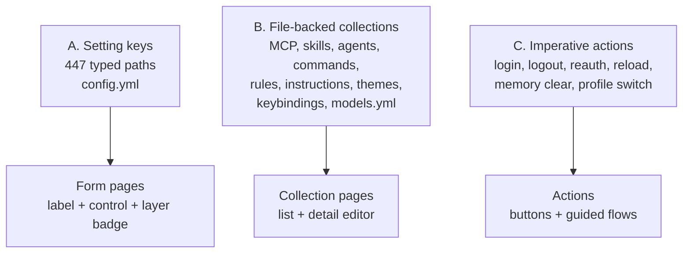

# Settings and configuration surface: audit and design spec

Status: proposed
Owner: Omperator desktop
Companion ADR: [`adr/020-config-surface-ownership.md`](./adr/020-config-surface-ownership.md)
Machine-checked manifest: [`settings-surface/coverage.json`](./settings-surface/coverage.json)

## 1. Goal

Everything a person can do in the OMP terminal, they can do in the Omperator GUI. Today the GUI can
reach part of one of OMP's three configuration surfaces. This document maps all three, states what is
missing, and specifies the information architecture, control kit, protocol, and build order for a
complete settings overhaul.

The measurable form of the goal:

1. Every setting key the pinned runtime publishes is reachable, searchable, labelled, and editable.
2. Every file-backed OMP configuration collection (MCP servers, skills, agents, commands, rules,
   instruction files, themes, keybindings, custom providers) is listable and editable.
3. Every imperative OMP configuration action (provider login, MCP reauth, plugin reload, memory
   maintenance, profile switch) is invocable.
4. A test fails when a new OMP setting appears with no home in the GUI.

Point 4 is the load-bearing one. Coverage that is not enforced decays on the next runtime bump.

## 2. Where the evidence comes from

| Source | What it established |
|---|---|
| `omp config list` / `omp config list --json` (omp 17.1.3) | 439 settings keys, 11 print groups, per-key type, default, effective value, description |
| `oh-my-pi/packages/coding-agent/src/config/settings-schema.ts` | `SettingTab` (10 tabs), `TAB_GROUPS` (54 section headings), `UiBase`/`UiEnum`/`UiNumber`/`UiString`/`UiArray` metadata contract |
| `oh-my-pi/packages/coding-agent/src/config/keybindings.ts`, `packages/tui/src/keybindings.ts` | 36 app actions + 31 TUI actions = 67 rebindable actions |
| `oh-my-pi/packages/coding-agent/src/modes/theme/defaults/` | 98 built-in themes |
| `oh-my-pi/docs/*.md` | file formats for `models.yml`, `mcp.json`, `keybindings.yml`, `SKILL.md`, agents, rules, hooks, custom tools, extensions, profiles |
| `OMP-T4-appserver-adapters/packages/coding-agent/src/session/desktop-config-authority/authority.ts` | the bridge that publishes settings and catalog to Omperator; 421-key fork schema |
| `Omperator/apps/web/src/features/settings/*` | current GUI: 8104 lines, dynamic host-driven catalog, 5 rail groups |
| `Omperator/packages/host-wire/src/command.ts`, `packages/host-service/src/operations/dispatcher.ts` | the 9 config-related wire commands that exist today |

## 3. The three surfaces

OMP configuration is not one thing. It is three, and they need three different UI archetypes.



The current GUI implements a partial version of archetype A only.

### 3A. Setting keys

439 keys in upstream omp 17.1.3, 421 in the pinned fork, 447 in the union. Schema-declared grouping:

| OMP tab | Keys | Section headings declared in `TAB_GROUPS` |
|---|---:|---|
| appearance | 28 | Theme, Status Line, Display, Images |
| model | 43 | Thinking, Sampling, Prompt, Retry & Fallback, Advisor, Prewalk, Vision |
| interaction | 40 | Input, Approvals, Notifications, Speech, Collab, Magic Keywords, Startup & Updates, Power (macOS), Agent, Git |
| context | 27 | General, Compaction, Rules (TTSR), Experimental |
| memory | 30 | General, Auto-Learn, Mnemopi, Hindsight |
| files | 23 | Editing, Reading, Read Summaries, LSP |
| shell | 16 | Bash, Eval & Runtimes |
| tools | 54 | Available Tools, Todos, Grep & Browser, Computer, GitHub, Output Limits, Execution, Discovery & MCP, Developer |
| tasks | 26 | Modes, Subagents, Isolation, Commands & Skills |
| providers | 36 | Services, Fireworks, Tiny Model, Protocol, Timeouts, Privacy |
| **(no tab)** | **116** | none |

Key counts above are upstream's; the pinned fork's untabbed bucket is 112 of 421. The untabbed keys
are not obscure. They include `modelRoles`, `cycleOrder`, `enabledModels`,
`disabledProviders`, `extensions`, every `skills.*` discovery toggle, `task.disabledAgents`,
`task.agentModelOverrides`, `thinkingBudgets.*`, `statusLine.leftSegments`/`rightSegments`/`segmentOptions`,
`bashInterceptor.patterns`, all `gc.*`, all `commit.*`, and the `searxng.*` credentials.

They have no `ui` block because a terminal cannot render them well. `UiNumber` says so directly:
"Without options, a numeric setting has no UI representation (intentional hide)." `UiArray` says
"Without options, an array setting has no UI representation (config-file only)."

**This is the design opening.** The set of things OMP hides from its own settings panel is almost
exactly the set of things a real GUI renders trivially: records, ordered arrays, rule tables, chain
builders, unbounded numbers. The GUI should not inherit the terminal's rendering constraints.

### 3B. File-backed collections

| Collection | Location | Format | Today's UX | GUI status |
|---|---|---|---|---|
| MCP servers | `~/.omp/agent/mcp.json`, `<cwd>/.omp/mcp.json` | JSON, 4 transports (`stdio`, `sse`, `websocket`, `streamable-http`), per-server `enabled`, `toolFilter.include/exclude` globs, `disabledServers[]` | `/mcp add|list|remove|test|reauth|enable|disable|reconnect|reload` | absent |
| Skills | `<ancestor>/.omp/skills/*/SKILL.md`, `~/.omp/agent/skills/*/SKILL.md` | Markdown + YAML frontmatter (`name`, `description`, `argument-hint`, `user-invocable`, `model-invocable`) | discovery + `/skill:<name>` | read-only list |
| Subagents | `~/.omp/agent/agents/*.md`, `.omp/agents/*.md` | Markdown + frontmatter (`name`, `description`, `model`, `tools`, `effort`) | `/agents` control center | read-only list |
| Slash commands | `~/.omp/agent/commands/*.md`, `.omp/commands/*.md` | Markdown + frontmatter, `$1`/`$@`/`$ARGUMENTS` placeholders | autocomplete | absent |
| Rules | `~/.omp/agent/rules/*.{md,mdc}` | Markdown + frontmatter (`description`, `globs`, `always`) | prompt injection, `/omfg` forges one | absent |
| Instruction files | `SYSTEM.md`, `APPEND_SYSTEM.md`, `AGENTS.md`, `RULES.md`, `WATCHDOG.md`, `TITLE_SYSTEM.md` at user and project scope | Markdown | file edit only | absent |
| Themes | `~/.omp/agent/themes/*.json` plus 98 built-ins | JSON: `name`, `colors` (all tokens required), `vars`, `export`, `symbols` | `/settings` Appearance tab | absent (only the `theme.dark`/`theme.light` string keys) |
| Keybindings | `~/.omp/agent/keybindings.yml` | YAML mapping `actionId -> chord | chord[]`, 67 actions, profile-inherited | file edit only | absent |
| Models and providers | `~/.omp/agent/models.yml` | YAML: `providers.<id>.{baseUrl, apiKey, api, headers, auth, discovery, models[]}` with per-model `cost`, `contextWindow`, `compat` | file edit, `/models` picker | absent |
| Hooks / custom tools / extensions | `.omp/hooks/{pre,post}/*`, `.omp/tools/*`, `.omp/extensions/*` | code + manifests | `/extensions`, `/plugins`, `/marketplace` | absent |

### 3C. Imperative actions

Provider OAuth (`/login`, `/logout`), MCP lifecycle (`/mcp test|reauth|unauth|reconnect|reload`),
plugin lifecycle (`/reload-plugins`, `/plugins enable|disable`, `/marketplace install|uninstall|upgrade`),
memory maintenance (`/memory clear|stats|diagnose|enqueue|mm *`), profile switch, `omp config reset`,
usage reset (`/usage reset`), SSH host registry (`/ssh add|list|remove`).

Roughly 155 built-in slash command and subcommand entries exist in `builtin-registry.ts`. Most are
session verbs that belong in the composer or command palette, not settings. The configuration-mutating
subset above is what settings owns.

## 4. What the GUI does today

`apps/web/src/features/settings/` is well built for what it does. It is dynamic, not hardcoded:
`live-catalog.ts` ingests every `kind: "setting"` item from the host `CatalogFrame` and maps
`SettingsFrame` layers onto rows. There is a staged-draft store with revision-conflict handling and a
"Adopt latest / Save over" challenge. Control editors exist for boolean, enum, number, duration, text,
path, list, and map. `ModelRolesBlock.tsx` and `TaskAgentsBlock.tsx` are genuinely good bespoke editors
for `modelRoles` / `cycleOrder` and `task.agentModelOverrides` / `task.disabledAgents`.

The problem is not the machinery. It is that the machinery mirrors OMP's terminal IA and inherits
every hole in it.

### 4.1 Defects, each with evidence

**D1. The IA is an alphabetized mirror of `ui.tab`, and every untabbed key lands in one bucket.**
`live-catalog.ts:437` reads `const tab = safeText(wire.meta.tab, 64) ?? ADVANCED_SECTION_ID`. Any key
the schema left untabbed becomes "Advanced: Host settings without a curated home yet, shown with their
raw keys," and because `advanced` appears in no rail group it is swept into the "Host settings"
catch-all at `SettingsWorkspace.tsx:118-121`. Three counts, deliberately kept apart:

| Universe | Total keys | With `ui.tab` | Untabbed |
|---|---:|---:|---:|
| upstream `can1357/oh-my-pi` (matches omp 17.1.3) | 439 | 323 | **116** |
| the pinned fork that ships today | 421 | 309 | **112** |
| union, which the coverage manifest partitions | 447 | n/a | n/a |

So the bucket a user sees today holds 112 unlabelled rows sorted by raw path, and it grows to 116 when
the pin catches up. Among them are `modelRoles` and `cycleOrder`, rescued only because two bespoke
blocks target them by name.

**D2. The 54 section headings OMP declares are discarded.**
`live-catalog.ts:447-449` uses `group` as the second sort key and then calls
`settingRowFrom(entry.wire, entry.tab, issues)`. The group never reaches the renderer, so `interaction`
renders as 40 flat rows instead of 10 labelled sections.

**D3. Twelve rail sections are dead.**
`SettingsWorkspace.tsx:58-79` declares rail groups referencing 22 section ids. OMP publishes exactly
ten tab ids (`appearance`, `model`, `interaction`, `context`, `memory`, `files`, `shell`, `tools`,
`tasks`, `providers`). The other twelve never match: `general`, `keybindings`, `notifications`,
`speech`, `models`, `roles`, `agents`, `browser`, `terminal`, `mcp`, `extensions`, `remote-hosts`.
`entryById.get(id)` returns `undefined`, `grouped.length` is zero, and the group is skipped entirely.
The Integrations group, whose three ids are all dead, therefore never renders at all.

**D4. Twenty-two keys are censored and unwritable because of a substring regex, and thirteen of them
are innocuous.**
`authority.ts:27` defines
`SECRET_KEY = /(?:password|passwd|secret|token|credential|api[_-]?key|private[_-]?key|access[_-]?key|auth)/iu`
and `authority.ts:160-162` applies it per path segment with no word boundary. `authority.ts:433-434`
then omits `default` and `effective`, and `authority.ts:515-516` throws
`"sensitive setting values cannot be written through desktop authority"`. The full blast radius:

| Genuinely sensitive (9) | False positives (13) |
|---|---|
| `auth.broker.token`, `auth.broker.url`, `mnemopi.embeddingApiKey`, `mnemopi.llmApiKey`, `hindsight.apiToken`, `searxng.token`, `searxng.basicPassword`, `dev.autoqaPush.token`, `secrets.enabled`* | `display.showTokenUsage`, `share.redactSecrets`, `compaction.thresholdTokens`, `compaction.reserveTokens`, `compaction.keepRecentTokens`, `compaction.idleThresholdTokens`, `branchSummary.reserveTokens`, `memories.phase1InputTokenLimit`, `memories.fallbackTokenLimit`, `memories.summaryInjectionTokenLimit`, `mnemopi.injectionTokenLimit`, `hindsight.recallMaxTokens`, `commit.mapReduceMaxFileTokens` |

\* `secrets.enabled` is a boolean feature flag, not a secret. It is blocked because the segment
`secrets` matches. Every "…Tokens" number is blocked because the segment contains `token`.

**D5. The bridge reads five metadata fields the schema never declares.**
`authority.ts:183-194` forwards `min`, `max`, `unit`, `scopes`, `restartRequired`, `platform`,
`availability`, `maxItems`, `maxEntries` from the definition. Grep over `settings-schema.ts` finds
`restartRequired: 0`, `min: 0`, `unit: 0`, `scopes: 0`, `maxItems: 0`, `maxEntries: 0` occurrences.
Consequences: every number arrives unbounded and unitless, and `restartRequired` is always false even
for `computer.*`, which the docs say is captured when the session tool is constructed.

**D6. Conditional visibility is dropped.**
The schema declares 38 `ui.condition` predicates (`mnemopiActive` 18, `hindsightActive` 9,
`advisorEnabled` 4, `usageAwareFallbackEnabled` 2, plus `unexpectedStopDetection`, `planModeEnabled`,
`hasImageProtocol`, `autolearnActive`, `autoThinkingActive`). `authority.ts:441-442` forwards only
`tab` and `group`. So the GUI shows all 23 `mnemopi.*` and 27 `hindsight.*` keys even when
`memory.backend` is `off`.

**D7. `ordered` and `secret` UI hints are dropped.** `controlMetadata` does not forward them.
`cycleOrder`, `providers.webSearchOrder`, and the status line segment arrays lose the signal that
order is meaningful; the one `secret: true` key (Hindsight API Token) relies on the path regex instead.

**D8. The project scope tab can never appear.** `authority.ts:438` publishes `scopes: ["global","session"]`
for every key and `authority.ts:514` rejects anything else. `live-catalog.ts:459-461` intersects
`WIRE_WRITABLE_SCOPES` with that union, so the "This project" tab in `SCOPE_TAB_LABEL` is unreachable
even though `<cwd>/.omp/config.yml` is a first-class OMP layer.

**D9. Two control kinds have no editor.** `controls.tsx:293` returns `null` for `nested`.
`secret-reference` renders a status badge in `SettingRow.tsx` with no input, so a credential can be
observed but never set.

**D10. The pinned fork and upstream disagree on 34 keys, and nothing in CI reports it.**
The fork declares 421 keys, upstream declares 439. That is a net deficit of 18, which understates the
problem: the drift is asymmetric, 26 keys missing plus 8 extra.

*Missing from the fork (26), so the GUI cannot surface them at all today:* all five `computer.*`
(`enabled`, `backend`, `display`, `maxWidth`, `maxHeight`), `bash.patterns`, `bash.direnv`,
`bash.direnvLoadTimeoutMs`, `error.notify`, four `hindsight.*` timeouts (`recallTimeoutMs`,
`reflectTimeoutMs`, `requestTimeoutMs`, `retainTimeoutMs`), `mcp.renderMarkdownResults`,
`providers.imageOrder`, `providers.webSearchOrder`, `read.renderMarkdown`, `retry.usageAwareFallback`,
`retry.usageReservePct`, `retry.usageReservePolicy`, `searxng.engines`, `task.isolation.apply`,
`tools.xdevDocs`, `tools.xdevInlineDevices`, `tui.titleState`, and `workspace.additionalDirectories`.

*Extra in the fork (8), which will render until the pin advances:* four `appserver.remote*` keys
(`remoteAddress`, `remoteMode`, `remoteOrigins`, `remotePort`), two fork-local task keys
(`task.maxNestedConcurrency`, `task.nestedEager`), and the two upstream-removed legacy enums
`providers.image` and `providers.webSearch`, which upstream replaced with the `*Order` arrays.

Several of the missing keys are load-bearing for this spec: `bash.patterns` is the whole point of the
approvals rule table, `workspace.additionalDirectories` is one of only two keys on the Workspace roots
page, `providers.webSearchOrder` and `providers.imageOrder` are two of the `OrderedListEditor`'s
justifications, and the five `computer.*` keys are the entire Browser and computer use story. Phases 1
and 2 can ship against the current pin, but those surfaces stay thin until it advances.

### 4.2 Protocol inventory

Exists today (`packages/host-wire/src/command.ts`, `packages/host-service/src/operations/dispatcher.ts`):

| Command | Used by GUI | Purpose |
|---|---|---|
| `settings.read` | yes | settings frame with `effective`, `effectiveSource`, `default`, `configured`, `layers` |
| `settings.write` | yes | batched `{ path, scope, value | reset }` edits with `expectedRevision` |
| `catalog.get` | yes | items of kind `tool`, `model`, `command`, `setting`, `skill`, `agent`, `provider`, `mode` |
| `config.write` | **no** | raw config write, descriptor exists, never called |
| `broker.status` | yes | provider account broker state |
| `session.model.set` / `session.thinking.set` / `session.fast.set` / `session.mode.set` | yes | per-session runtime overrides, driven from the composer |

Zero protocol support for: MCP CRUD, skills write, agents write, commands, rules, instruction files,
keybindings, themes, profiles, memory maintenance, models.yml, provider login/logout.

## 5. Design

### 5.1 Principles

1. **Task-first IA, not schema-mirror IA.** People arrive with an intent ("make it cheaper",
   "add an MCP server", "stop it running `rm`"). Group by intent. OMP's `ui.tab` is a terminal
   rendering artifact and is not the product's information architecture.
2. **A GUI is not a terminal.** The 116 untabbed keys and the 48 discarded headings are the value.
   Render what OMP could not.
3. **Total, tested coverage instead of a dumping ground.** Delete the Advanced section. Replace it
   with a partition of the key space that CI verifies.
4. **Layers are first-class.** Show where each value comes from and let the user choose where it lands.
5. **Files are settings.** A rule file and a boolean are both configuration. One rail, one search box.
6. **Teach the CLI.** Every row shows its `omp config` path and copies it. The GUI should make people
   better at OMP, not dependent on the GUI.

### 5.2 Information architecture

Six groups, 31 rail entries, 80 named sections, verified in
[`settings-surface/coverage.json`](./settings-surface/coverage.json). Key counts are over the 447-key
union so the manifest survives a runtime pin bump.

The rail follows the shape of a turn: which model does the work, what it may run, what it knows, how
the run behaves, what you see, and the app itself.

| Group | Pages (keys) | Keys | Collections hosted here |
|---|---|---:|---|
| **Agent** | Models (33) · Providers (40) · Reliability (24) · Subagents (21) · Skills and commands (16) · Model catalog (0) | 134 | `models.yml`, credentials, agent definitions, skills, slash commands |
| **Tools** | Files and code (29) · Shell and runtimes (22) · Web and desktop (17) · Output and devices (14) · MCP and extensions (7) · Permissions (5) | 94 | `mcp.json`, hooks, custom tools, plugins |
| **Context** | Compaction (24) · Memory (20) · Stream rules (7) · Instructions and workspace (1) · Memory: Mnemopi (23) · Memory: Hindsight (27) | 102 | instruction files, `rules/*.md` |
| **Session** | Behavior (19) · Modes (11) · Startup and power (8) · Sharing and collab (7) | 45 | none |
| **Interface** | OMP terminal (33) · Voice and alerts (19) · Omperator (0) · Keyboard (0) | 52 | 98-theme gallery, `keybindings.yml` |
| **System** | Storage (12) · Hosts and remote (4) · Diagnostics (4) · Profiles (0) · Updates (0) | 20 | profiles, paired hosts |

**Depth lives in sections, not in more rail entries.** Every page carries named section headings, so
a 40-key page reads as five short lists rather than one scroll. `Providers` is the largest page and
its biggest section is 19 rows. This is the layer OMP already declares (54 `TAB_GROUPS` headings) and
the current GUI throws away; recovering it is what lets the rail shrink.

Three page templates, and a page may combine them:

- **Form.** Sections of labelled rows. The default.
- **Collection.** List plus detail editor over `config.resource.*`. Used for MCP servers, skills,
  agents, commands, rules, instruction files, themes, keybindings, and custom model providers.
- **Action.** Buttons and guided flows over `config.action.invoke`. Used for login, reauth, reload,
  memory maintenance, profile switch, updates.

`Memory: Mnemopi` and `Memory: Hindsight` carry `visibleWhen: mnemopiActive` / `hindsightActive` and
leave the rail when the backend is off. Hidden pages stay reachable from search with a "shown because
you searched for it" affordance, so nothing is ever unreachable.

Three cross-cutting views sit above the rail and own no keys:

- **All settings.** A flat, filterable table of every key: path, type, effective value, source layer,
  writable scopes. This is `omp config list` in the GUI and is the pressure valve that keeps the
  curated IA honest without an Advanced bucket.
- **Tool availability.** A grid of every `<tool>.enabled` row, rendered from the same store rows their
  owning sections use. Same control, two placements, one source of truth.
- **Changed from default.** Every row where `configured` is true, grouped by layer, with revert.

Two naming decisions worth defending. `Interface > OMP terminal` carries a banner saying these
settings style the OMP terminal, including the terminal pane inside Omperator, and not Omperator's own
chrome; Omperator's theme and accent live on the separate `Interface > Omperator` page. Conflating
those two is the likeliest confusion in this whole surface. And `Session` is a real group, not a
leftovers bin: steering, modes, startup, and sharing all govern how one run behaves, which is why the
earlier draft's "Behavior" group was renamed rather than kept.

#### Page anatomy and density

The rail is the only persistent navigation and is exactly two levels: six group headers and their
pages. There is no third level. `Memory: Mnemopi` and `Memory: Hindsight` are peer pages under
Context whose labels carry the prefix, not children of `Memory`; the manifest ids `context/memory`,
`context/memory-mnemopi`, and `context/memory-hindsight` are siblings for the same reason. Below
1220px of window height the rail is an accordion showing one group's pages at a time, for reasons the
next subsection works out; the wireframe below is cropped to the expanded group plus the collapsed
headers around it. Search sits above the rail and matches path, label, description, section name, and
enum values, so the rail is for browsing and search is for arriving.

```text
┌── Settings ─────────────────────────────────────────────────────────────────┐
│ ⌕ search all settings        [ This machine | This project | This run ]     │
├───────────────────────┬─────────────────────────────────────────────────────┤
│ All settings          │  Providers                                          │
│ Changed from default  │  Credentials, routing, and the services the agent   │
│ Tool availability     │  reaches for.                                       │
│                       │                                                     │
│ AGENT                ▾│  Accounts ─────────────────────────────── 2 rows ─  │
│   Models              │   Auth broker URL          [ ················· ] ⓘ  │
│   Providers          ●│   Auth broker token        [ set · from env    ] ⓘ  │
│   Reliability         │   ┌ Connected accounts ─────────────────────────┐   │
│   Subagents           │   │ anthropic  oauth   ✓        [Sign out]      │   │
│   Skills and commands │   │ openai     api key ✓        [Rotate]        │   │
│   Model catalog       │   │                             [Add account]   │   │
│ TOOLS              6 ›│   └─────────────────────────────────────────────┘   │
│ CONTEXT            4 ›│                                                     │
│ SESSION            4 ›│  Routing ─────────────────────────────── 10 rows ─  │
│ INTERFACE          4 ›│   Disabled providers    [ollama ×][opencode ×] +    │
│ SYSTEM             5 ›│   OpenRouter variant    ( default           ▾ )     │
├───────────────────────┼─────────────────────────────────────────────────────┤
│                       │  3 changes staged   [ Discard ]  [ Save changes ]   │
└───────────────────────┴─────────────────────────────────────────────────────┘
```

Density rules, so a 40-row page stays readable:

- One row is one setting. Label and control on the same line, description under the label at reduced
  emphasis, never a separate expandable panel.
- Section headers are sticky within the scroll container and carry a row count, so position is always
  legible without a scrollbar estimate.
- A row carries at most three adornments: a source badge when the value does not come from `default`
  (`⌐g` global, `⌐p` project, `⌐r` this run, `⌐c` CLI overlay), a modified dot with revert, and a
  restart chip. A row at its default with no restart requirement shows none of them, which is the
  common case and keeps the page quiet.
- Group headers in the rail show a dot when any page under them has staged changes, so the save bar is
  never the only signal that something is dirty.
- Long enum, ordered-list, chain, and rule editors open in place and push content down. They never
  open a modal, because comparing against neighbouring rows is the whole reason those keys are hard.
- The scope tabs are page-level, not row-level. Switching scope re-reads the same page against a
  different layer rather than adding a per-row scope control.

Sections may also carry `visibleWhen`. `Reliability > Advisor` uses `advisorEnabled`, and
`Reliability > Retry` hides its three `retry.usage*` rows behind `usageAwareFallbackEnabled`, mirroring
the schema predicates the bridge will start forwarding in Phase 0. A hidden section leaves a one-line
stub naming the setting that would reveal it, so conditional depth never reads as missing depth.

#### The rail at real sizes

The wireframe above is cropped and shows only the first three groups, so it does not prove the rail
fits. Doing the arithmetic says it does not:

| | rows |
|---|---:|
| cross-cutting views (All settings, Changed from default, Tool availability) | 3 |
| group headers | 6 |
| pages | 31 |
| **total** | **40** |
| typical, with both memory backends off | **38** |

At a 28px row and roughly 156px of chrome (titlebar, search plus scope tabs, save bar), a 768px window
leaves 21 slots and a 1080px window leaves 33. Thirty-eight rows fit in neither. Expanding everything
by default would mean the rail always scrolls, which is what "31 entries" was quietly hiding.

So the rail is an accordion, and the numbers drive the breakpoints:

- **Height under 1220px (the common case).** Exactly one group is expanded, the rest collapse to a
  header with a page count. At rest that is 3 pinned + 6 headers + at most 6 pages = **15 rows**,
  inside the 21 slots a 768px window gives. Navigating to a page in another group expands that group
  and collapses the previous one, which is what keeps the 15-row guarantee true. The active route's
  group is always expanded and scrolled into view on mount, so a deep link never lands on a collapsed
  rail.
- **Height 1220px or more.** Every group expands, because 38 rows × 28px plus chrome is 1220px and at
  that point the accordion only costs clicks. A large monitor gets the flat list.
- **Width under 768px** (`apps/mobile` ships this exact bundle, so this is a shipping requirement, not
  a courtesy). The rail becomes the root screen of a drill-down: choosing a page replaces the view and
  a back affordance returns to the rail. Search stays pinned at the root.

A user may pin a second group open by clicking its header directly rather than navigating into it.
That is an explicit override: the rail then exceeds its slot budget and scrolls, and the set of pinned
groups persists for the session. Automatic navigation never pins anything, so the default stays
single-expanded and the fit guarantee holds unless someone opts out of it.

In every mode the three cross-cutting views are pinned above the scroll area and never scroll away,
group headers are sticky, and the rail scrolls independently of page content. A group header carries a
dot when any page beneath it has staged changes, which is what makes collapsing safe: dirty state is
never hidden by the accordion.

This is the one place the design trades a click for density. The trade is acceptable because search is
pinned above the rail and matches section names as well as keys, so the rail is for browsing a group
you already have in mind and search is for arriving at a setting you can name.

#### Rejected alternative

The first cut of this IA had eight groups and 40 pages, one page per coherent key cluster. It was
measurably worse and is recorded here so it is not re-proposed: two different pages resolved to the
leaf id `routing`, twelve pages held four keys or fewer (three held two), the rail ran to 40 entries,
the group named `Behavior` was a leftovers bin, and OMP's 54 declared section headings went unused.
Collapsing to six groups and moving depth into 80 named sections fixed all five without changing the
coverage contract, which is the part worth keeping.

### 5.3 The coverage manifest

`coverage.json` declares, per page **section**, an `exact` key list and a `prefixes` list. Resolution
is two-tier and deliberately unambiguous:

1. Collect **all** sections whose `exact` list contains the key. More than one is an error.
2. If none, collect **all** sections whose `prefixes` match. More than one is an error.
3. Zero matches at both tiers is an error.

First-match-wins ordering is explicitly rejected: it lets a broad prefix silently shadow a narrower one
and the shadowing is invisible in review. Specific claims must be spelled as exact keys.

Claiming at section granularity rather than page granularity is what makes the manifest drive three
things at once: the rail, the page body, and the section headings. It also caught four real overlaps
while this IA was being cut (`hindsight.mentalModel*` claimed by both a curated section and a broad
prefix on the same page), which is the check earning its place before a single line of UI exists.

**Prefixes are authoring shorthand, never a catch-all.** A prefix is legitimate only where an entire
namespace genuinely belongs in one section (`edit.`, `retry.`, `statusLine.`). The generator expands
every claim and commits the resulting `keys` arrays, so the CI check is "regenerate and the diff must
be empty". A key that appears in either input schema and matches no claim fails the build; a key that
matches a claim lands as a reviewable manifest diff naming its exact section. Nothing is silently
absorbed.

The generator takes **two** schema inputs, and the guarantee above depends on that. The pinned fork
schema decides what the GUI can render today. An upstream schema snapshot lets sections pre-claim
keys the pin has not reached; without it, the 26 upstream-only keys would drop out of every `keys`
array and an upstream addition would stay invisible until a pin bump. Both live in a checked-in
`docs/settings-surface/schema-snapshot.json` carrying each schema's key list and originating commit,
so generation and CI stay deterministic and offline and a refresh is its own reviewable commit.
Drift *between* the two schemas is reported, not failed, because the pin advances on its own schedule.

An earlier draft of this manifest carried two catch-all sections as future insurance against a pin
bump. They claimed zero keys, and they would have let a new upstream key pass the check with nobody
looking at it, which defeats the one promise this whole mechanism exists to keep. They were removed.
**No section may exist to absorb unclaimed keys**, and the checker also fails any section whose
expansion is empty, because a claim that owns nothing is either dead or a catch-all in waiting.

Runtime-unknown keys are a different problem from schema drift and get a different answer. If a
connected host publishes a key the committed manifest has never seen, the page renders it in an
"Unrecognized keys" affordance and the client records it in `issues[]`. That is a diagnostic for a
mismatched host, not a substitute for curation.

None of these three scripts exist yet; all are Phase 1 deliverables, and this is their contract.
`scripts/gen-settings-coverage.mjs` will expand claims against the two-schema snapshot;
`scripts/refresh-schema-snapshot.mjs` will update that snapshot; `scripts/check-settings-coverage.mjs`
will run in `pnpm check` and fail on unclaimed keys, double-claimed keys, empty sections, and any diff
against a fresh regeneration. `docs/settings-surface/README.md` records the candidate sources for each
input and the tradeoff Phase 1 must settle, including a refresh cadence for the upstream side, since
nothing forces it to stay current. Until those land, `coverage.json` is reviewed input rather than
generated output.

At runtime, `apps/web/src/features/settings/route-map.ts` is generated from the same manifest.

### 5.4 Control kit

Existing: `SwitchEditor`, `EnumEditor`, `NumberEditor`, `TextEditor`, `ListEditor`, `MapEditor`.

New editors required, each justified by a specific key set:

| Editor | Keys it serves | Why the current kit fails |
|---|---|---|
| `OrderedListEditor` (drag reorder, add from catalog) | `cycleOrder`, `providers.webSearchOrder`, `providers.imageOrder`, `modelProviderOrder`, `statusLine.leftSegments`, `statusLine.rightSegments`, `hindsight.recallTypes` | `ListEditor` renders unordered chips; these are priority lists |
| `RuleTableEditor` (ordered rows of typed objects, first match wins) | `bash.patterns` (`{match, approval}`), `bashInterceptor.patterns` (`{pattern, tool, message}`) | arrays of objects have no editor at all |
| `FallbackChainEditor` (record of ordered model selectors, with role / `provider/model` / `provider/*` key kinds) | `retry.fallbackChains` | `MapEditor` is string-to-string; values here are arrays with wildcard semantics |
| `ScopedArrayEditor` (bare entries plus path-scoped entries) | `enabledModels`, `disabledProviders` | these accept `{path|paths|pathPrefix|pathPrefixes} + {models|providers|values|items}` objects mixed with strings |
| `SegmentBuilder` (pick from 24 `StatusLineSegmentId` values, left/right, per-segment options) | `statusLine.leftSegments`, `statusLine.rightSegments`, `statusLine.segmentOptions` | three coupled keys that only make sense edited together, with a live preview |
| `SearchableEnumEditor` | `snapcompact.shape` (18 values), `tts.localVoice` / `speech.voice` (12), `providers.tinyModelDevice` (14), `providers.tinyModelDtype` (14), `tools.format` (13) | a bare `<select>` with 18 opaque values is unusable |
| `SecretFieldEditor` (set, rotate, clear, never read back; shows source and status) | the 9 genuinely sensitive keys | `secret-reference` currently has no input |
| `RecordOfRecordEditor` | `providers.maxInFlightRequests`, `task.agentPrewalk`, `modelTags`, `statusLine.segmentOptions` | `MapEditor` flattens to string values |
| `PathListEditor` (directory picker, validates existence) | `workspace.additionalDirectories`, `skills.customDirectories`, `worktree.base`, `browser.screenshotDir`, `python.interpreter`, `ruby.interpreter`, `julia.interpreter`, `shellPath`, `mnemopi.dbPath` | text input with no picker or validation |

`nested` stops returning `null`: it renders children inline behind a disclosure.

Every row, regardless of editor, carries: label, description, control, a layer badge naming the source
(`default` / `global` / `project` / `session` / `cli`), a modified dot with revert-to-default, a
restart-required chip when applicable, and a copyable `omp config set <path>` affordance.

### 5.5 Protocol

Nine bespoke domain APIs would be nine chances to diverge. Two generic families instead.

**`config.resource.*`** for archetype B. One CRUD seam over a closed `kind` enum.

```ts
type ConfigResourceKind =
  | "mcpServer" | "skill" | "agent" | "command" | "rule"
  | "instruction" | "theme" | "keybinding" | "modelProvider" | "hook" | "customTool";

type ConfigResourceScope = "user" | "project";

// list  -> { revision, resources: ConfigResourceSummary[] }
{ command: "config.resource.list",   args: { kind, scope? } }
// read  -> { revision, resource: { id, kind, scope, body, parsed?, readOnly, source } }
{ command: "config.resource.read",   args: { kind, scope, id } }
// write -> { revision, restartRequired }
{ command: "config.resource.write",  args: { kind, scope, id, body }, expectedRevision }
{ command: "config.resource.delete", args: { kind, scope, id },       expectedRevision }
```

Security contract, non-negotiable and mirroring the existing `settings.write` posture:

- The wire carries `kind` + `scope` + an opaque **stable id**. It never carries a filesystem path,
  root, or directory. The renderer cannot name a target outside the resource space.
- The OMP-side authority resolves `kind` + `scope` to an allowed base directory, canonicalizes the
  candidate, and enforces containment before any read or write. Symlink escape is rejected.
- Ids are validated against a conservative charset and rejected if they normalize outside the base.
- The host authenticates the IPC sender and derives host and project ownership server-side, exactly as
  the session channels do. No renderer-supplied `hostId` is trusted for authorization.
- Writes are revision-guarded and atomic (temp file plus rename), with the same rollback discipline
  `#settingsWriteNow` already uses for settings.
- Bodies are size-bounded. Parsed views are best-effort: a resource that fails to parse still returns
  its raw body so the user can fix it in the GUI rather than being locked out.
- `readOnly: true` for resources discovered from foreign providers (`.claude`, `.codex`, `.gemini`)
  and for bundled built-ins. The GUI offers "copy to my config" instead of an edit.

**`config.action.*`** for archetype C. One invoke seam over a closed action enum.

```ts
type ConfigActionId =
  | "provider.login" | "provider.logout"
  | "mcp.test" | "mcp.reauth" | "mcp.unauth" | "mcp.reconnect"
  | "plugins.reload" | "plugin.enable" | "plugin.disable"
  | "marketplace.add" | "marketplace.install" | "marketplace.uninstall" | "marketplace.upgrade"
  | "memory.stats" | "memory.diagnose" | "memory.clear"
  | "profile.list" | "profile.create" | "profile.switch"
  | "settings.resetAll";

{ command: "config.action.invoke", args: { action, params? }, expectedRevision? }
// -> { ok, revision?, output?, followUp?: { kind: "openUrl" | "awaitCode", ... } }
```

Actions that are destructive (`memory.clear`, `settings.resetAll`, `config.resource.delete`,
`provider.logout`) require an explicit confirmation in the GUI naming the exact target, and the
authority refuses them without a matching `expectedRevision`.

`provider.login` returns a `followUp` describing the OAuth handoff; Omperator opens the URL in the
system browser and polls, rather than embedding a credential flow in the renderer.

**Bridge fixes to `settings.read` / `settings.write`** (all in the OMP fork's
`desktop-config-authority/authority.ts`):

1. Replace the substring `SECRET_KEY` regex with an explicit sensitive-path allow-list, generated from
   the schema's `ui.secret` flag plus a reviewed additions list. Never infer sensitivity from
   substrings. Fixes D4 and unblocks 13 keys.
2. Forward `ui.condition`, `ui.ordered`, and `ui.secret` in the item metadata. Fixes D6 and D7.
3. Forward `ui.group` and preserve `TAB_GROUPS` ordering. Fixes D2.
4. Add `min` / `max` / `unit` / `restartRequired` to the settings schema for the keys that need them,
   then the existing forwarding at `authority.ts:183-194` starts producing real data. Fixes D5.
   This is upstream schema work and can be contributed to `can1357/oh-my-pi`.
5. Publish per-key `scopes` reflecting reality, and accept `scope: "project"` writes against
   `<cwd>/.omp/config.yml`. Fixes D8.
6. Publish `secretStatus` for sensitive keys (set / unset / from-env / from-broker) without the value,
   so `SecretFieldEditor` can show state.

### 5.6 What stays out of settings

Session verbs (`/compact`, `/branch`, `/fork`, `/retry`, `/export`, `/dump`, `/share`, `/tan`, `/btw`)
belong to the composer and command palette. Settings owns the durable configuration that governs them,
not the act of running them. The one exception is a read-only slash command reference under
Agents > Slash commands, because that is where a user goes to learn what is invocable and to author
their own.

## 6. Build order

Each phase is independently shippable and independently verifiable.

**Phase 0: unblock the bridge.** Repo: the OMP fork (`OMP-T4-appserver-adapters`, pushed to
`wolfiesch/oh-my-pi`). Items 1 through 3 and 5 of section 5.5. Add a fork↔upstream schema diff to CI.
*Done when:* the 13 false-positive keys report values and accept writes; `condition`, `ordered`,
`secret`, and `group` appear in the catalog frame; a project-scope write lands in `<cwd>/.omp/config.yml`;
CI reports the asymmetric drift (26 missing, 8 extra, 34 differing, net -18) rather than a single net number.

**Phase 1: IA and total coverage.** Repo: Omperator. Settle the two schema sources, land
`schema-snapshot.json` plus `refresh-schema-snapshot.mjs`, generate `coverage.json` and
`route-map.ts`, add `check-settings-coverage.mjs` to `pnpm check`, rebuild `SettingsWorkspace` around
the six groups, render section headings, delete `ADVANCED_SECTION`, wire the three cross-cutting
views, remove the twelve dead rail section ids.
*Done when:* every key the pinned runtime publishes renders in a named section with a label; adding a
key to either input schema without claiming it fails `pnpm check`; adding a key that *is* claimed
produces a manifest diff naming its section; "All settings" lists the same key count as
`omp config list` against the pinned runtime.

**Phase 2: control kit.** The nine new editors, `nested` disclosure, layer badges, restart chips,
per-row `omp config` copy, conditional page visibility driven by the now-forwarded `condition`.
*Done when:* no row renders `UnsupportedNotice` for any key in the pinned schema; `retry.fallbackChains`,
`bash.patterns`, and `statusLine.*Segments` are editable without leaving the GUI.

**Phase 3: resource CRUD.** `config.resource.*` in the fork authority, host-service dispatcher,
`host-wire` descriptors, client, and the collection pages for MCP, skills, agents, commands, rules, and
instruction files. Security contract from 5.5 enforced and tested.
*Done when:* an MCP server can be added, tool-filtered, enabled, disabled, and removed from the GUI and
`~/.omp/agent/mcp.json` matches; a rule and a subagent can be authored end to end; a containment test
proves `id: "../../etc/passwd"` is rejected.

**Phase 4: actions, accounts, and presentation collections.** `config.action.*`, the accounts page with
OAuth handoff, profiles, memory maintenance, the 98-theme gallery with custom theme import, and the
67-action keybinding editor.
*Done when:* a provider can be logged in and out from the GUI; a profile can be created and switched;
a theme can be previewed and applied; a keybinding can be remapped and the change appears in
`~/.omp/agent/keybindings.yml`.

**Phase 5: parity ledger.** A checked-in table mapping every OMP surface item (from this document's
section 3) to its GUI affordance, plus a test that fails when a new built-in slash command, catalog
kind, or resource kind appears with no ledger entry.
*Done when:* the ledger has zero `absent` rows for configuration surfaces, and the test is in `pnpm check`.

## 7. Verification strategy

| Layer | Check |
|---|---|
| Coverage | `check-settings-coverage.mjs`: zero unclaimed, zero double-claimed, manifest matches claims |
| Drift | fork↔upstream schema diff reported on every CI run; a new upstream key is visible before it ships |
| Control completeness | a test asserts no key in the pinned schema resolves to `UnsupportedNotice` |
| Write path | extend `settings-store.test.ts` fixtures to cover each new editor's value shape and the revision-conflict challenge |
| Resource security | containment tests for `..`, absolute paths, symlinks, and foreign-scope ids on every resource kind |
| End to end | Playwright specs that edit a key of each control kind, a resource of each kind, and invoke a non-destructive action, then assert the on-disk file |
| Client parity | `apps/mobile` shares the web bundle and inherits everything. `apps/ios` is native Swift and does not mount the settings workspace; the spec does not change iOS, and the parity ledger records iOS settings as out of scope until a Swift surface is planned |

## 8. Risks

**Fork divergence.** Every bridge change lands in the OMP fork and must be released and re-pinned
before the GUI can use it. Phases 0 and 3 are therefore two-repo phases with a pin bump in the middle.
Mitigation: the GUI degrades to the current behavior when a capability is absent, using the existing
`implementedFeatures` negotiation in `host-service/src/server.ts:862-866`.

**Upstreamability.** Schema additions (`min`, `max`, `unit`, `restartRequired`) are genuinely useful to
`can1357/oh-my-pi` and should be offered upstream rather than carried as fork debt. The IA, route map,
and resource protocol are Omperator's and stay in the fork or in Omperator.

**Scope creep into session verbs.** Section 5.6 is the fence. Settings configures; the composer acts.

**Secret handling.** Replacing a broad regex with an allow-list makes more keys writable. The allow-list
must be reviewed as a security change, not a UI change, and `SecretFieldEditor` must never render a
value it received, because after the fix the authority still will not send one.
