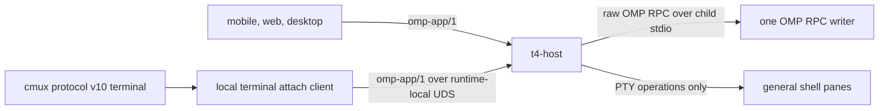

# ADR-020: Portable runtimes use one host-owned OMP authority

- Status: accepted for Portable Agent Platform v1.
- Scope: one top-level portable runtime, its one cmux machine, and its one OMP session authority.
- Supersedes: no prior authority decision. This narrows ADR-013 and ADR-019 for portable runtimes.

## Context

A portable runtime must expose the same OMP session through `omp-app/1` and through a cmux terminal without allowing two processes to mutate the session JSONL or related OMP state. The current T4 host already owns one raw OMP RPC child per writable session. Starting `omp --resume` in a cmux pane would instead open the same session as another writer. Raw OMP RPC is a parent-child stdio primitive and has no safe second-client attach transport.

The scheduling unit is one requested top-level runtime. It contains one headless cmux machine, one T4 host service, one writable OMP authority, and optional browser support. Shared gateways and controllers are outside this process boundary and never own OMP or cmux state.

## Decision

The runtime supervisor starts one `t4-host` and one headless cmux process. `t4-host` is the sole process allowed to start a writable OMP child for the runtime session. The child invocation remains:

```text
omp --mode rpc --session <runtime-owned-session-path>
```

Raw OMP RPC remains on that child's stdin and stdout. It is never exposed on a network or Unix listener and is never multiplexed to a second parent.

The application and cmux paths converge before reaching OMP:



The terminal attach client is an `omp-app/1` client, not an OMP session owner. It selects the runtime's fixed host and session identity, sends `session.attach`, consumes the same snapshot, replay, and live events as application clients, and sends prompts and controls through the host. The external cmux connection still uses exact cmux protocol v10. The local attach hop does not create a new public protocol.

A general shell pane may coexist with the authority. It must not receive a writer-capable OMP invocation for the hosted session. The runtime's user-facing OMP command is either the attach client or unavailable. The writer-capable OMP binary is supervisor-private. Defense in depth still requires the OMP session lock and the runtime generation fence to reject any direct duplicate invocation.

## Ownership and cardinality

| Resource | Owner | Cardinality and rule |
| --- | --- | --- |
| runtime process group | runtime supervisor | one per running generation |
| cmux state and private socket | headless cmux | one cmux machine per runtime |
| `omp-app/1` socket and client fan-out | `t4-host` | one host per runtime; many observers |
| OMP RPC stdio and child lifetime | `t4-host` | one writable child for the runtime session |
| OMP session JSONL and agent loop | OMP RPC child | one writer; all clients share it |
| shell and terminal PTYs | `t4-host` and cmux | may be many; they do not own OMP state |
| desired state and generation | deployment driver and control store | never inferred from OMP or cmux state |

`session.attach` is observational. The first prompt or control operation starts or reuses the host's existing per-session supervisor. Concurrent app and terminal clients therefore share one RPC child and one durable event sequence.

## Failure and fencing rules

- A gateway or client reconnect never starts an OMP process.
- A cmux pane restart reconnects its attach client to `t4-host`; it never runs `omp --resume` against the hosted JSONL.
- A host or OMP child failure removes runtime readiness before replacement work begins.
- A replacement generation cannot start `t4-host`, cmux, or OMP until the prior process group and storage writer are proven fenced.
- An uncertain fence remains fail closed. A Kubernetes Lease or an exclusive sessions root alone is not writer proof.
- Shutdown drains routes, closes clients, stops the OMP child, stops cmux and optional browser children, flushes state, and only then releases the generation fence.

## Current implementation boundary

The existing host path already satisfies the central ownership seam: `t4-host` stores one in-flight or active RPC supervisor per session and spawns `omp --mode rpc --session ...` over private stdio. Existing application clients attach through `omp-app/1` and reuse that supervisor.

Portable runtime admission remains blocked until later work packages provide all of the following:

1. a terminal-facing `omp-app/1` attach client that never opens OMP session files;
2. cmux launch metadata that supplies the exact runtime-local host and session identity to that client;
3. a supervisor that drains readiness and terminates the complete process group on child failure;
4. a descendant OMP integration revision with duplicate-writer and generation-fence proof; and
5. an end-to-end test in which an application prompt and a cmux-terminal prompt appear in the same session history while the observed writer count remains one.

Official OMP's exclusive derived sessions root is useful isolation but is not sufficient portable-runtime fencing. The packaged legacy bridge remains a compatibility input, not the portable topology. No runtime may advertise the cmux-to-OMP attach capability before the terminal client and writer proof pass.

## Consequences

- `omp-app/1` remains the only bounded OMP application protocol, including inside the runtime.
- cmux protocol v10 remains untouched and continues to own terminal, layout, sizing, and browser panes.
- Raw OMP RPC remains private stdio.
- P3-04 implements a client of an existing authority rather than a second OMP runtime.
- P1-04, P2-04, P3-03, and P3-07 must fail closed on duplicate or uncertain writers.
- A direct interactive `omp --resume` for the hosted session is unsupported even when the session JSONL is visible.
